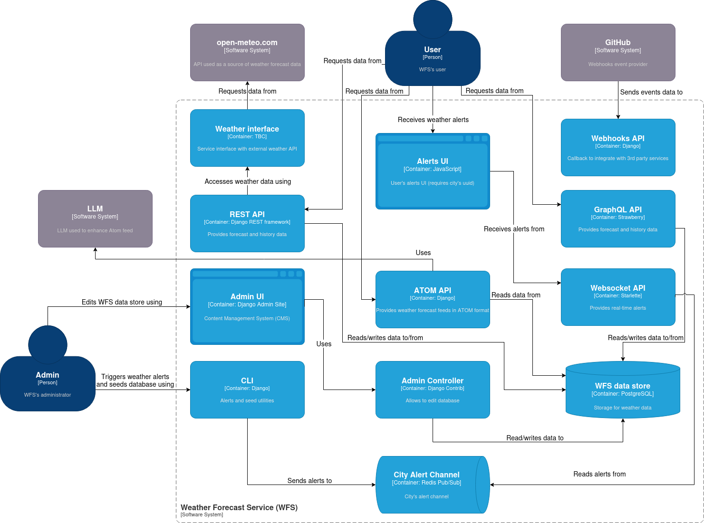

  

This repository provides supplementary content for the book.
You'll find material that wasn't included in the book, along with selected examples.
We also recorded the examples as videos, which can be found in [this YouTube playlist](https://www.youtube.com/playlist?list=PLRkB-vSK4koOHYIhpKXuXpipVpByEKuPu).

For more information about the book, visit [learningapistyles.com](https://learningapistyles.com)

## Table of Contents

| Chapter | Tests |
|---|---|
| 1. API Concepts |  |
| 2. API Design |  |
| 3. [Network](./src/network/README.md) |  |
| 4. [Web Protocols](./src/http/README.md) |  |
| 5. [REST](./src/django/docs/REST.md) |  |
| 6. [GraphQL](./src/django/docs/GRAPHQL.md) |  |
| 7. [Web Feeds](./src/django/docs/WEB-FEEDS.md) |  |
| 8. [gRPC](./src/grpc/README.md) |  |
| 9. [Webhooks](./src/django/docs/WEBHOOKS.md) |  |
| 10. [WebSocket](./src/django/docs/WEBSOCKET.md) |  |
| 11. [Messaging](./src/rabbitmq/README.md) |  |

## System Overview

The weather forecast service (WFS) is a Django-based application that aggregates the majority of API styles described in this book.
Illustrated below, the [C4 container diagram](https://c4model.com/) shows WFS' main actors and components.

<figure>
  
</figure>
