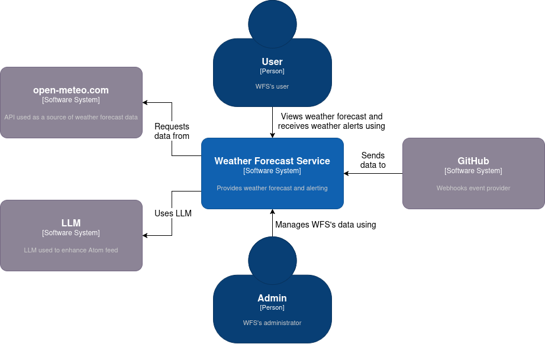

## Weather Forecast Service

The weather forecast service (WFS) is a Django-based application that provides various APIs to access weather data.
The following are [C4](https://c4model.com/) diagrams of WFS.

###### C4 Context Diagram



###### C4 Container Diagram


## Requirements

* [Docker Engine](https://docs.docker.com/engine/install/) or [Docker Desktop]( https://docs.docker.com/desktop/)
* [Docker Compose](https://docs.docker.com/compose/install/).

### Lab Setup

```bash
cd src/django
docker compose build --build-arg UID=$(id -u) --build-arg GID=$(id -g)
docker compose up --detach --wait
```

<details>
<summary>Show the above example as an animated GIF</summary>

[](https://youtu.be/oA9Y07YiBdo)

</details>

Visit app at [localhost:8000](http://localhost:8000)

> [!IMPORTANT]
> When working with GitHub Codespaces, you'll use a unique URL containing the Codespace's name instead of the localhost URL.

### Lab Teardown

```bash
docker compose down --volumes
```

### API Styles

* [REST API](./docs/REST.md)
* [GraphQL API](./docs/GRAPHQL.md)
* [Web Feeds API](./docs/WEB-FEEDS.md)
* [Webhooks API](./docs/WEBHOOKS.md)
* [WebSocket API](./docs/WEBSOCKET.md)
