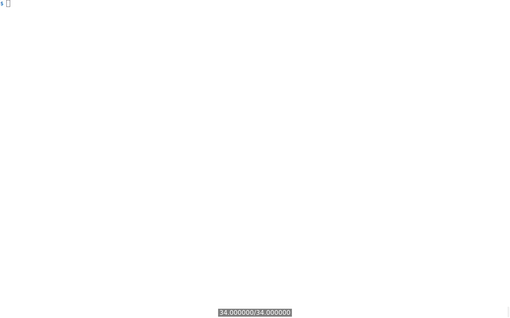
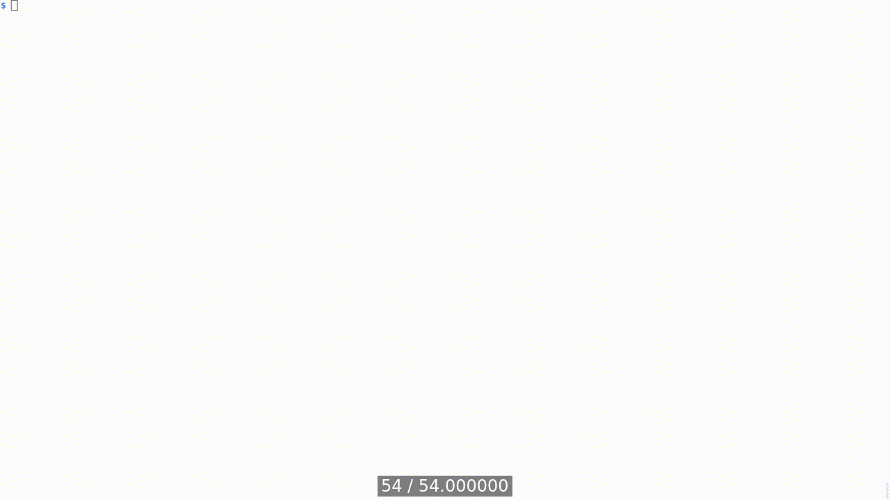
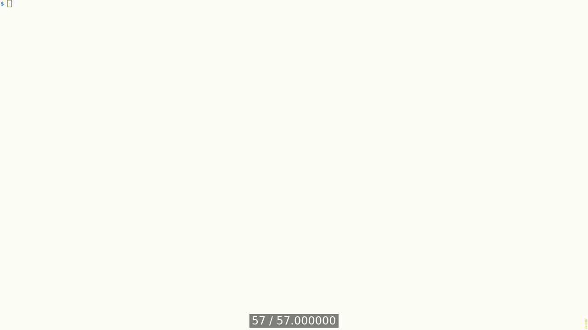

[Table of Contents](../../../README.md) | [&larr; REST](../docs/REST.md) | [Web Feeds &rarr;](../docs/WEB-FEEDS.md)

## GraphQL

The following is the supplementary content to the GraphQL chapter.

### Requirements

* [Docker Engine](https://docs.docker.com/engine/install/) or [Docker Desktop](https://docs.docker.com/desktop/)
* [Docker Compose](https://docs.docker.com/compose/install/)

### GraphQL Design Goals

GraphQL originated in the times when mobile devices were booming.
Around 2012, the technological stack of mobile web browsers and HTML5 was insufficient to provide fast rendering and interactivity of web-based applications.
GraphQL was born from Facebook's effort to rewrite its iOS and Android applications.
This led Facebook (now Meta) to reevaluate the computational demands of REST APIs when retrieving high volumes of graph-like data over the network.

The key design principles behind GraphQL are:[^1]

* **Product-centric**—The design of GraphQL started with the question of how to design the ideal API for front-end developers, and then it worked backward to the technology, resulting in the language and runtime to meet those needs.

* **Hierarchical**—GraphQL request is structured hierarchically using a graph that allows a model of relationships among nested objects, allowing the response data to match the hierarchy of the request.

* **Strong-typing**—GraphQL service defines the type of system specific to the application.
Every request executed against the GraphQL service runs in the context of a type system.
The type system outlines the capabilities available to clients to to be consume via a schema.
Strong-typing ensures that each variable, field, input, etc., is associated with a specific data type, and data match what is defined in the schema.
For example, if a field is defined as an `Int`, then any value that is not `Int` is unacceptable.
Strong-typing helps to maintain data integrity and ensures that GraphQL operations are valid within that system and syntactically correct before executing the operation.

* **Client-specified response**—In GraphQL, the client specifies how it'll consume service capabilities described by the schema.
This is done by the client formulating GraphQL requests using GraphQL's fields defined in the schema.
A response to such a request contains only what the client asks for.

* **Introspective**—A GraphQL service's type system allows clients to query the schema of the GraphQL API itself.
This allows developers to explore and understand the API without consulting external documentation.
For example, a tool like [GraphiQL](https://github.com/graphql/graphiql) allows the client to ask the GraphQL service about available elements in its schema, such as types, fields, queries, mutations, subscriptions, etc.

A good starting point to learn GraphQL is to visit the [GraphQL official website](https://graphql.org/learn/), and follow the freely available [GraphQL For Beginners with JavaScript](https://knowthen.com/category/graphql-for-beginners-with-javascript/) course.

### Lab Setup

The following steps create three Docker containers: `django-app`, `django-postgres`, and `django-redis`.
These steps need to be executed only once.

```bash
cd src/django
docker compose build --build-arg UID=$(id -u) --build-arg GID=$(id -g)
docker compose up --detach --wait
```

<details>
<summary>Show the above example as an animated GIF</summary>

[](https://youtu.be/y2yBxjlmX-g)

</details>

### Security

This section describes how to secure the GraphQL API using JSON Web Token (JWT) for authentication and authorization.

#### Authentication and Authorization (JWT)

First, visit [http://localhost:8000/graphiql](http://localhost:8000/graphiql).

> [!IMPORTANT]
> When working with GitHub Codespaces, you'll use a unique URL containing the Codespace's name instead of the localhost URL.

To obtain a JWT token, use the mutation's `obtainJwt` field.
The token is to be used in the `Authorization` header as a bearer token to authenticate and authorize the user.

```graphql
mutation GetJWT {
  obtainJwt(username: "admin", password: "admin") {
    token {
      token
    }
  }
}
```

Alternatively, you can use the [curl](https://curl.se/) command to obtain the JWT token by making an HTTP POST request to [http://localhost:8000/graphql](http://localhost:8000/graphql) endpoint, as shown below.

```bash
# Set environment variables
CSRF_TOKEN=$(docker compose exec app openssl rand -hex 16)
MUT='mutation {obtainJwt(username:\"admin\",password:\"admin\"){token{token}}}'

# Get JWT token with curl
docker compose exec app curl --silent \
       --request POST \
       --header "Content-type: application/json" \
       --header "X-csrftoken: $CSRF_TOKEN" \
       --header "Cookie: csrftoken=$CSRF_TOKEN" \
       --data-raw "{\"query\": \"$MUT\"}" \
       "http://localhost:8000/graphql"

{"data": {"obtainJwt": {"token": {"token": "eyJhbGciOiJIU..."}}}}
```

<details>
<summary>Show the above example as an animated GIF</summary>

[](https://youtu.be/lwirGlQ0XFE)

</details>

### Implementation

This section contains various GraphQL documents that can be used to interact with the WFS's GraphQL API.
A GraphQL document is a request string (or a text file) used by the client to perform operations allowed by the GraphQL schema.

GraphQL operations can be mapped to the _CRUD_ operations described in the [REST chapter](./REST.md).
Examples of this mapping are provided in the sections below.

#### Read

Query operation is used to read data from the GraphQL API.
The query operation is similar to the `GET` method in REST API, or the _Read_ operation from CRUD.

The following is a query document `GetAllCities` that retrieves all cities from the WFS's GraphQL API.

```graphql
query GetAllCities {
  cities {
    uuid
    name
    country
    region
  }
}
```

#### Update

The mutation operation is used to modify data in the GraphQL API.
The mutation operation is similar to the `POST`, `PUT`, and `DELETE` methods in REST API, or the _Create_, _Update_, and _Delete_ operations from CRUD.
This section contains an example of _Update_.

The following example describes the operation of renaming a city using the GraphQL API:
1. **Obtain the UUID of the city to be renamed.**—This example uses Tokyo.
The `GetTokyo` query operation retrieves the UUID of the city using the `cities` field.
2. **Obtain a JWT token to be used for authentication.**—Our implementation requires authentication for the mutation operations.
The `ObtainJWT` document contains a mutation that retrieves the JWT token using the `obtainJwt` field.

> [!IMPORTANT]
> Remember to pass the JWT token as a bearer token in the `Authorization` header.
> ```
> {
>   "Authorization": "Bearer <JWT_TOKEN>"
> }
> ```

The `RenameCity` document describes a mutation operation that renames a city using the `updateCity` field.
The `UUID` of the city to be renamed is a variable, which is passed as the `uuid` argument.
The `data` argument contains the new name of the city.

```graphql
# Get the UUID of the city
query GetTokyo($name: String = "Tokyo") {
  cities(filters: {name: {iExact: $name}}) {
    uuid
    name
  }
}

# Obtain JWT token to be used for authentication
mutation ObtainJWT {
  obtainJwt(username: "admin", password: "admin") {
    token {
      token
    }
  }
}

mutation RenameCity ($city: UUID ="b3d00be5-a1bd-423c-9d04-04277c453461") {
  updateCity(data: {uuid: $city, name: "Tokio"}) {
    name
  }
}
```

<details>
<summary>Show the above example as an animated GIF</summary>

[](https://youtu.be/ookaCCThk3Y)

</details>

### Documentation

Documentation in GraphQL comes out of the box.
The GraphQL API is self-documenting, meaning that any changes to the schema are automatically reflected in the documentation.
This is advantageous over REST APIs, where documentation is often outdated or incomplete.

#### Schema introspection

One of the features of GraphQL is its ability to introspect the schema.
This means that you can query the schema itself to get information about the types, fields, and operations available in the GraphQL API.
This feature is used to generate documentation for the API, making it in sync with the code.

The `__schema` field can be used to explore the schema of the GraphQL API as demonstrated in the following example.
It is also possible to construct a full introspection query (available for example [here](https://portswigger.net/web-security/graphql#running-a-full-introspection-query)) that provides the complete schema of the GraphQL API, including operations.

```graphql
{
  __schema {
    types {
      name
      kind
      fields {
        name
      }
    }
  }
}
```

<details>
<summary>Show the above example as an animated GIF</summary>

[](https://youtu.be/NHeNkeXEHnQ)

</details>

### Lab Teardown

The following command stops and removes the Docker containers created in the [lab setup](#lab-setup) step.

```bash
docker compose down
```

[Table of Contents](../../../README.md) | [&larr; REST](../docs/REST.md) | [Web Feeds &rarr;](../docs/WEB-FEEDS.md)

[^1]: See, the overview section in the latest release of [GraphQL specification](https://spec.graphql.org/).
