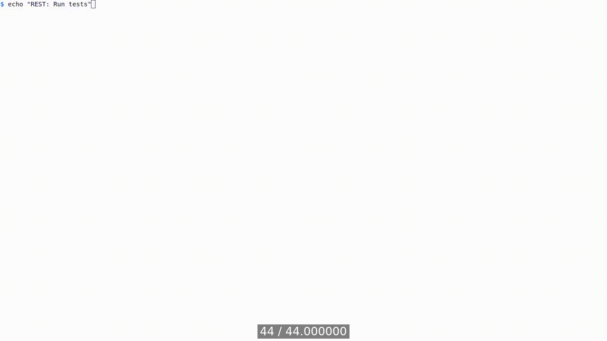
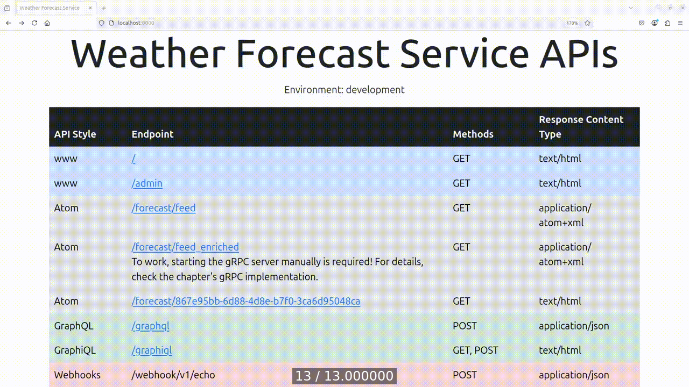

[Table of Contents](../../../README.md) | [&larr; Web Protocols](../../http/README.md) | [GraphQL &rarr;](../docs/GRAPHQL.md)

## REST

The following is the supplementary content to the REST chapter.
The examples in this chapter show how to work with the WFS' REST APIs.

### Requirements

* [Docker Engine](https://docs.docker.com/engine/install/) or [Docker Desktop](https://docs.docker.com/desktop/)
* [Docker Compose](https://docs.docker.com/compose/install/)

### Lab Setup

The following steps create three Docker containers: `django-app`, `django-postgres`, and `django-redis`.
These steps need to be executed only once.

```bash
cd src/django
docker compose build --build-arg UID=$(id -u) --build-arg GID=$(id -g)
docker compose up --detach --wait
```

<details>
<summary>Show the above example as an animated GIF</summary>

[](https://youtu.be/oA9Y07YiBdo)

</details>

Visit app at [http://localhost:8000](http://localhost:8000)

> [!IMPORTANT]
> When working with GitHub Codespaces, you'll use a unique URL containing the Codespace's name instead of the localhost URL.

### Implementation

This section demonstrates how to implement a REST API using [Django REST Framework](https://www.django-rest-framework.org/).
The implementation follows the API design patterns described in the API Design Patterns chapter.
To execute the code examples, first set up the lab environment, as shown in the [lab setup](#lab-setup).

### Implementing Update from CRUD

The book covers the implementation of `Create`, `Read`, and `Delete` operations.
This section shows how to implement the `Update` operation, particularly _partial update_ and _complete update_ operations.
The partial update allows the client to send only a portion of the object it wishes to modify, while a complete update requires the entire object to be passed, which replaces the updated resource.

#### Partial Update

The following code shows how to implement the partial update operation.
This operation is called _partial update_ because the client in the request body sends only a part of the object it wishes to modify.
The operation uses the HTTP `PATCH` method.

```python
# src/django/app/core/api/rest/v1/views/city_views.py
...

class CityView(GenericAPIView):
    ...
    def patch(self, request, uuid):  # <1>
        try:
            city = CityRepository.get_by_id(uuid)  # <2>
        except Exception:
            errors = [f"Failed to read from City database."]
            return error_response(errors, 500)

        if not city:  # <3>
            errors = [f"Referenced City ({uuid}) not found."]
            return error_response(errors, 404)

        serializer = self.get_serializer(city, data=request.data, partial=True)  # <4>

        if not serializer.is_valid():  # <5>
            errors = get_serializer_errors(serializer)
            return error_response(errors, 400)

        try:
            serializer.save()  # <6>
        except Exception:
            errors = [f"Failed to save City ({uuid}) object."]
            return error_response(errors, 500)   # <6>

        return success_response(serializer.data, 200)  # <6>
      ...
```

1. The `patch()` method handles the HTTP `PATCH` request.
The method argument `uuid` is used to identify the resource.

2. If a database read fails while retrieving the record (resource), the HTTP response with a 500 (Internal Server Error) status code is returned.

3. If the city doesn't exist, the HTTP response with a 404 (Not Found) status code is returned.

4. A serializer is created from the `city` object and request data.
The `partial=True` keyword argument allows the client to update a portion of the city data.

5. The request's data is validated; if the data is invalid, the HTTP response with a 400 (Bad Request) status code is returned.

6. If the saving data operation fails, the HTTP response with a 500 (Internal Server Error) status code is returned, indicating that something went wrong with the database write.
If the operation succeeds, the HTTP response containing the serialized city data with a 200 (OK) status code is returned.

The following code shows the `curl` client making a partial resource update with an HTTP `PATCH` request.

> [!IMPORTANT]
> The `UUID` of the city will be different in your environment.

```bash
CREDENTIALS_PAYLOAD='{"username":"admin","password":"admin"}'
ACCESS_TOKEN=$(docker compose exec app bash -c \
  "curl \
  --data '$CREDENTIALS_PAYLOAD' \
  --header 'Content-Type: application/json' \
  --request 'POST' \
  --silent 'http://localhost:8000/api/jwt/obtain' | \
  jq --raw-output '.access'")
CITY_UUID=$(docker compose exec app bash -c \
  "curl --request 'GET' --silent 'http://localhost:8000/api/cities?search_name=Tokyo' | \
  jq --raw-output '.results[0].uuid'")

CITY_UPDATE_PAYLOAD='{"name":"Tokio"}'
docker compose exec app bash -c \
       "curl \
       --data '$CITY_UPDATE_PAYLOAD' \
       --header 'Authorization: Bearer $ACCESS_TOKEN' \
       --header 'Content-Type: application/json' \
       --request PATCH \
       --silent \
       'http://localhost:8000/api/cities/$CITY_UUID' | \
       jq"
{
  "results": [
    {
      "uuid": "07608d6d-6a26-4f43-8e96-e3e18cb50591",
      "name": "Tokio",
      "country": "Japan",
      "region": "Asia",
      "timezone": "Asia/Tokyo",
      "latitude": "35.689500",
      "longitude": "139.691700",
      "deleted": false
    }
  ]
}
```

#### Complete Update

The following code shows how to implement the complete update operation.
This operation performs a _complete update_ (_full update_).
The client sends the entire object in the request body, which replaces the updated resource.
The complete update uses the HTTP `PUT` method.

```python
# src/django/app/core/api/rest/v1/views/city_views.py

class CityView(GenericAPIView):
    ...
    def put(self, request, uuid):  # <1>
        try:
            city = CityRepository.get_by_id(uuid)  # <2>
        except Exception:
            errors = [f"Failed to read from City database."]
            return error_response(errors, 500)

        if not city:  # <3>
            errors = [f"Referenced City ({uuid}) not found."]
            return error_response(errors, 404)

        serializer = self.get_serializer(city, data=request.data)  # <4>
        
        if not serializer.is_valid():  # <5>
            errors = get_serializer_errors(serializer)
            return error_response(errors, 400)

        try:
            serializer.save()  # <6>
        except Exception:
            errors = [f"Failed to update City ({uuid}) object."]
            return error_response(error, 500)  # <6>

        return success_response(serializer.data, 200)  # <6>
    ...
```

1. The `put()` method handles an HTTP `PUT` request.
The method argument `uuid` is used to identify the resource.

2. If a database read fails while retrieving the record (resource), the HTTP response with a 500 (Internal Server Error) status code is returned.
 
3. If the city doesn't exist, the HTTP response with a 404 (Not Found) status code is returned.

4. A serializer is created from the `city` object and request data.

5. If the request data is invalid, the HTTP response with a 400 (Bad Request) status code is returned.

6. The city resource is updated by calling the `save()` method on the serializer.
Unsuccessful operation assumes that the database write didn't happen, and the HTTP response with a 500 (Internal Server Error) status code is returned.
If the operation succeeds, the HTTP response containing the updated data with a 200 (OK) status code is returned.

The following command shows the `curl` client making a complete resource update with an HTTP `PUT` request.

> [!IMPORTANT]
> The `UUID` of the city will be different in your environment.

```bash
CREDENTIALS_PAYLOAD='{"username":"admin","password":"admin"}'
ACCESS_TOKEN=$(docker compose exec app bash -c \
  "curl \
  --data '$CREDENTIALS_PAYLOAD' \
  --header 'Content-Type: application/json' \
  --request 'POST' \
  --silent 'http://localhost:8000/api/jwt/obtain' | \
  jq --raw-output '.access'")

CITY_UUID=$(docker compose exec app bash -c \
  "curl --request 'GET' --silent 'http://localhost:8000/api/cities?search_name=Istanbul' | \
  jq --raw-output '.results[0].uuid'")

CITY_UPDATE_PAYLOAD='{"name": "Ankara", "country": "Turkey", "region": "Asia", "timezone": "Europe/Istanbul", "latitude": "39.9334", "longitude": "32.8597"}'

docker compose exec app bash -c \
       "curl \
       --data '$CITY_UPDATE_PAYLOAD' \
       --header 'Authorization: Bearer $ACCESS_TOKEN' \
       --header 'Content-Type: application/json' \
       --request PUT \
       --silent \
       'http://localhost:8000/api/cities/$CITY_UUID' | \
       jq"
{
  "results": [
    {
      "uuid": "7941b0df-ccf5-48bd-a525-5392170f5117",
      "name": "Ankara",
      "country": "Turkey",
      "region": "Asia",
      "timezone": "Europe/Istanbul",
      "latitude": "39.933400",
      "longitude": "32.859700",
      "deleted": false
    }
  ]
}
```

### Security

This section shows how to obtain [JSON Web Tokens](https://jwt.io/) (JWTs), which are used to authenticate and authorize the user when interacting with protected endpoints of the WFS REST API.
Additionally, we describe how to enable [Transport Layer Security](https://en.wikipedia.org/wiki/Transport_Layer_Security) (TLS) for the WFS REST API.

#### Authentication and Authorization (JWT)

The example below shows how to obtain, verify, refresh, and revoke the JWT token.
The JWT is implemented using the [Simple JWT](https://django-rest-framework-simplejwt.readthedocs.io/en/latest/) plugin for the Django REST framework.

```bash
# Obtain JWT tokens
CREDENTIALS_PAYLOAD='{"username":"admin","password":"admin"}'
ACCESS_TOKEN=$(docker compose exec app bash -c \
  "curl \
  --data '$CREDENTIALS_PAYLOAD' \
  --header 'Content-Type: application/json' \
  --request 'POST' \
  --silent 'http://localhost:8000/api/jwt/obtain' | \
  jq --raw-output '.access'")
REFRESH_TOKEN=$(docker compose exec app bash -c \
  "curl \
  --data '$CREDENTIALS_PAYLOAD' \
  --header 'Content-Type: application/json' \
  --request POST \
  --silent \
  'http://localhost:8000/api/jwt/obtain' | \
  jq --raw-output '.refresh'")

echo $ACCESS_TOKEN
echo $REFRESH_TOKEN

# Verify JWT token
docker compose exec app bash -c \
       "curl \
        --data '{\"token\": \"$ACCESS_TOKEN\"}' \
        --header 'Content-Type: application/json' \
        --request POST \
        --silent \
        --output /dev/null \
        --write-out '%{http_code}\n' \
        'http://localhost:8000/api/jwt/verify' \
        jq"

# Refresh JWT token
docker compose exec app bash -c \
       "curl \
        --data '{\"refresh\":\"$REFRESH_TOKEN\"}' \
        --header 'Content-Type: application/json' \
        --request POST \
        --silent \
        'http://localhost:8000/api/jwt/refresh' | \
        jq"

# Revoke JWT token
docker compose exec app bash -c \
       "curl \
        --data '{\"refresh\":\"$REFRESH_TOKEN\"}' \
        --header 'Content-Type: application/json' \
        --output /dev/null \
        --request POST \
        --silent \
        --write-out '%{http_code}\n' \
        'http://localhost:8000/api/jwt/revoke' | \
        jq"
```

<details>
<summary>Show the above example as an animated GIF</summary>

[](https://youtu.be/4u9u40OjUOM)

</details>

#### Transport Layer Security

> [!NOTE]
> When working with GitHub Codespaces, you don't need to enable TLS. The Codespaces environment is already secured with TLS.

This example shows how to enable TLS for the WFS REST API.
It requires changing an environment variable in the _src/django/compose.yaml_ file and restarting the Docker containers.
The TLS is enabled by setting the `TLS_ENABLE` environment variable to `1`.
The default value is `0`, which disables TLS.

```bash
# Enable TLS
sed --in-place 's/- TLS_ENABLE=0/- TLS_ENABLE=1/g' compose.yaml

# Restart containers
docker compose up --detach --wait
```

<details>
<summary>Show the above example as an animated GIF</summary>

[](https://youtu.be/ZP6l6Cytfec)

</details>

The following code shows a fragment of a start-up script that generates a self-signed SSL certificate.

[chapter-rest-ssl-startup]: #chapter-rest-ssl-startup
```bash
# src/django/app/scripts/startup.sh

...
if [ "$TLS_ENABLE" -eq 1 ]; then # <1>
  UVICORN_OPTIONS_TLS="
    --ssl-certfile /etc/wfs/ssl/certs/wfs.crt \
    --ssl-keyfile /etc/wfs/ssl/private/wfs.key
  " # <2>
  ...
  openssl req \
    -config /usr/src/config/wfs.ssl.conf \
    -keyout /etc/wfs/ssl/private/wfs.key \
    -newkey rsa:4096 \
    -out /etc/wfs/ssl/certs/wfs.crt \
    -nodes \
    -x509 # <3>
  ...
  uvicorn config.asgi:application_django ... $UVICORN_OPTIONS_TLS # <4>
...
```

1. The `TLS_ENABLE` environment controls the SSL certification creation and secure startup of the Django application that exposes the REST API.

2. The `UVICORN_OPTIONS_TLS` environment variable contains flags used by the [uvicorn](https://www.uvicorn.org/) asynchronous server gateway interface (ASGI) to secure the traffic.

3. The `openssl` program generates a self-signed SSL certificate from _src/django/app/config/wfs.ssl.conf_ configuration described below in [chapter-rest-ssl-config].

4. The `uvicorn` program starts the Django application using certificates provided in the `UVICORN_OPTIONS_TLS` environment variable.
The generated certificates are then passed to the Django (and Starlette) applications that expose APIs.

```
[req] # <1>
default_bits        = 4096
distinguished_name  = req_distinguished_name
prompt              = no
req_extensions      = req_ext

[ca] # <2>
default_ca  = CA_default

[CA_default] # <3>

default_crl_days  = 30
default_days      = 365
default_md        = sha1

[req_distinguished_name] # <4>
commonName        = localhost

[req_ext] # <5>
subjectAltName    = @alt_names
basicConstraints  = critical,CA:FALSE
keyUsage          = critical,digitalSignature
extendedKeyUsage  = serverAuth

[alt_names] # <6>
IP.1  = 127.0.0.1
```

1. The `req` section defines settings for certificate requests.

2. The `ca` section defines the certificate authority (CA) settings.

3. The `CA_default` section defines the default settings for the CA.

4. The `req_distinguished_name` section defines the certificate's distinguished name (DN), the `commonName` field (see Moxie Marlinspike's talk [More Tricks for Defeating SSL](https://youtu.be/5dhSN9aEljg?t=23m19s) from Def Con 17).
Notice that values are set to `localhost`, indicating that the certificate is to work only in the local environment.

5. The `req_ext` section defines several extensions for the certificate generation.
The `subjectAltName` subject alternative names (SAN) for the certificate points to a list of additional domain names (`@alt_names`) or IP addresses that the certificate will secure.
The `basicConstraints` establishes constraints of the certificate.
The `CA:FALSE` specifies that the certificate is not a certificate authority, meaning it cannot issue or sign other certificates.
The `keyUsage` defines the purposes for which the certificate's public key can be used.
The `digitalSignature` permits the key to verify digital signatures.
The `extendedKeyUsage` refines the certificate's intended use.
`serverAuth` designates the certificate for authenticating servers, making it suitable for TLS/SSL protocols used in securing web servers and other services.
The `critical` flag indicates that this extension are to be recognized and enforced by any certificate-using application.

6. This section defines SANs for the certificate.
In this case, it's the loopback IP address, also known as localhost.

> [!WARNING]
> When visiting [https://localhost:8000/](https://localhost:8000/), the browser will display a warning that _your connection is not private_.
> To secure connection in the local environment add the application's SSL certificate to the browser's exception list.
> To do it visit [https://localhost:8000](https://localhost:8000) (for HTTP traffic), accept the risk, and continue to the webpage.

Now application traffic is secured which can be confirmed by visiting [https://localhost:8000](https://localhost:8000)

### Documentation

The example below shows how to convert the OpenAPI schema (described in the YAML file) to the API documentation using the Swagger UI.

```bash
# Get OpenAPI schema
docker compose exec app bash -c \
       "curl --output schema.yaml --silent http://localhost:8000/api/docs/v1/schema/manual"

# Run Swagger UI
docker run \
       --env SWAGGER_JSON_URL=schema.yaml \
       --publish 127.0.0.1:8888:8080 \
       --rm \
       --volume ${PWD}/app/schema.yaml:/usr/share/nginx/html/schema.yaml \
       swaggerapi/swagger-ui
```

<details>
<summary>Show the above example as an animated GIF</summary>

[](https://youtu.be/IoxR6ySJHyI)

</details>

The generated documentation is available at [http://localhost:8888](http://localhost:8888)

> [!IMPORTANT]
> When working with GitHub Codespaces, you'll use a unique URL containing the Codespace's name instead of the localhost URL.

### Testing

The command below shows how to test the WFS APIs. The commands run BDD tests and unit tests.

```bash
# Run tests
docker compose exec app python manage.py behave --no-input
docker compose exec app python manage.py test --no-input

# Run tests with coverage
docker compose exec app coverage run manage.py test --no-input
docker compose exec app coverage report --skip-covered --show-missing --sort cover
```

<details>
<summary>Show the above example as an animated GIF</summary>

[](https://youtu.be/4YoPunK1HP4)

</details>

#### CRUD

The following example shows how to perform `Create`, `Read`, `Update`, and `Delete` actions on the city resources with the REST API.

```bash
# Get JWT access token
CREDENTIALS_PAYLOAD='{"username":"admin","password":"admin"}'
ACCESS_TOKEN=$(docker compose exec app bash -c \
  "curl \
  --data '$CREDENTIALS_PAYLOAD' \
  --header 'Content-Type: application/json' \
  --request 'POST' \
  --silent 'http://localhost:8000/api/jwt/obtain' | \
  jq --raw-output '.access'")

# CREATE: Create a city
CREATE_CITY_PAYLOAD='{"name":"Copenhagen",
  "country":"Denmark",
  "region":"Europe",
  "timezone":"Europe/Copenhagen",
  "latitude":55.676100,
  "longitude":12.568300}'
docker compose exec app bash -c \
       "curl \
       --data '$CREATE_CITY_PAYLOAD' \
       --header 'Authorization: Bearer $ACCESS_TOKEN' \
       --header 'Content-Type: application/json' \
       --request 'POST' \
       --silent \
       'http://localhost:8000/api/cities' | \
       jq"

# READ: Obtain UUID of the city and get the city
CITY_UUID=$(docker compose exec app bash -c \
  "curl --request 'GET' --silent 'http://localhost:8000/api/cities?search_name=Copenhagen' | \
  jq --raw-output '.results[0].uuid'")
docker compose exec app bash -c \
       "curl \
       --request 'GET' \
       --silent \
       'http://localhost:8000/api/cities/$CITY_UUID' | \
       jq"

# UPDATE: Perform a partial city update
UPDATE_CITY_PAYLOAD='{"name":"København","country":"Danmark"}'
docker compose exec app bash -c \
       "curl \
       --data  '$UPDATE_CITY_PAYLOAD' \
       --header 'Authorization: Bearer $ACCESS_TOKEN' \
       --header 'Content-Type: application/json' \
       --request 'PATCH' \
       --silent \
       'http://localhost:8000/api/cities/$CITY_UUID' | \
       jq"

# UPDATE: Perform a full city update
UPDATE_CITY_PAYLOAD='{"name":"Copenhagen",
  "country":"Denmark",
  "region":"Europe",
  "timezone":"Europe/Copenhagen",
  "latitude":55.676100,
  "longitude":12.568300}'
docker compose exec app bash -c \
       "curl \
       --data '$UPDATE_CITY_PAYLOAD' \
       --header 'Authorization: Bearer $ACCESS_TOKEN' \
       --header 'Content-Type: application/json' \
       --request 'PUT' \
       --silent \
       'http://localhost:8000/api/cities/$CITY_UUID' | \
       jq"

# DELETE: Remove the city
docker compose exec app bash -c \
       "curl \
       --header 'Authorization: Bearer $ACCESS_TOKEN' \
       --request 'DELETE' \
       --silent \
       'http://localhost:8000/api/cities/$CITY_UUID?soft_delete#true' | \
       jq"
```

<details>
<summary>Show the above example as an animated GIF</summary>

[](https://youtu.be/xwf7O9uddeg)

</details>

#### Pagination

This example shows how to paginate over the REST API.

```bash
# First page
docker compose exec app bash -c \
       "curl --silent 'http://localhost:8000/api/cities?page=1&page_size=1' | \
       jq"

# Second page
docker compose exec app bash -c \
       "curl --silent 'http://localhost:8000/api/cities?page=2&page_size=1' | \
       jq"

# Last page
docker compose exec app bash -c \
       "curl --silent 'http://localhost:8000/api/cities?page=6&page_size=1' | \
       jq"
```

<details>
<summary>Show the above example as an animated GIF</summary>

[](https://youtu.be/AwwRJIffxYM)

</details>

#### Searching, Sorting, Filtering, and Counting

The following example shows how to search, sort, and filter datasets using the REST API.
Note that the `fields` query parameter is used to control the fields returned in the response payload.

```bash
# Searching
docker compose exec app bash -c \
       "curl --silent 'http://localhost:8000/api/cities?search_name=Mexico' | \
       jq"

# Sorting
docker compose exec app bash -c \
       "curl --silent 'http://localhost:8000/api/cities?sort=-name' | \
       jq"

# Filtering and Counting
docker compose exec app bash -c \
       "curl --silent 'http://localhost:8000/api/cities?page_size=10&sort=-name&fields=uuid,name' | \
       jq"
```

<details>
<summary>Show the above example as an animated GIF</summary>

[](https://youtu.be/yCDT9kOdgf0)

</details>

#### Soft-delete and Hard-delete

The following example shows how to perform soft-delete and hard-delete operations on the city resources.
The soft-delete operation marks the resource as deleted, while the hard-delete operation removes it from the database.

```bash
CITY_UUID=$(docker compose exec app bash -c \
  "curl --silent 'http://localhost:8000/api/cities?search_name=Sao%20Paulo' | \
  jq --raw-output '.results[0].uuid'")
CREDENTIALS_PAYLOAD='{"username":"admin","password":"admin"}'
ACCESS_TOKEN=$(docker compose exec app bash -c \
  "curl \
  --data '$CREDENTIALS_PAYLOAD' \
  --header 'Content-Type: application/json' \
  --request 'POST' \
  --silent 'http://localhost:8000/api/jwt/obtain' | \
  jq --raw-output '.access'")

# Soft-delete the city
docker compose exec app bash -c \
       "curl \
       --header 'Authorization: Bearer $ACCESS_TOKEN' \
       --request DELETE \
       --silent \
       'http://localhost:8000/api/cities/$CITY_UUID?soft_delete=true' | \
       jq"

# Soft-delete the city again
docker compose exec app bash -c \
       "curl \
       --header 'Authorization: Bearer $ACCESS_TOKEN' \
       --request DELETE \
       --silent \
       'http://localhost:8000/api/cities/$CITY_UUID?soft_delete=true' | \
       jq"

# Get soft-deleted city
docker compose exec app bash -c \
       "curl \
       --silent \
       'http://localhost:8000/api/cities/$CITY_UUID' | \
       jq"

# Hard-delete the city
docker compose exec app bash -c \
       "curl \
       --header 'Authorization: Bearer $ACCESS_TOKEN' \
       --request DELETE \
       --silent \
       'http://localhost:8000/api/cities/$CITY_UUID?soft_delete=false' | \
       jq"

# Hard-delete the city again
docker compose exec app bash -c \
       "curl \
       --header 'Authorization: Bearer $ACCESS_TOKEN' \
       --request DELETE \
       --silent \
       'http://localhost:8000/api/cities/$CITY_UUID?soft_delete=false' | \
       jq"
```

<details>
<summary>Show the above example as an animated GIF</summary>

[](https://youtu.be/MOi9HxZjZf4)

</details>

#### Caching

This example shows the effect of response server-side caching.
Note the difference in latency between two consecutive response times.

<details>
<summary>Show the above example as an animated GIF</summary>

[](https://youtu.be/6TZonVwU7QY)

</details>

### APIs

This section contains descriptions of API endpoints not covered in the book.

#### Geocoding API

The geocoding API allows you to convert city names into geographic coordinates (latitude and longitude) and vice versa.

```bash
# Test geocoding API
docker compose exec app bash -c \
      "curl --silent http://localhost:8000/api/geocoding?city=Sydney | \
       jq"
docker compose exec app bash -c \
       "curl --silent 'http://localhost:8000/api/geocoding?lat=55.675966&lon=12.569117' | \
       jq"
```

#### Seed API

The seed API lets you populate weather data for a given city and year.

```bash
# Get UUID of the first city
CITY_UUID=$(curl --silent http://localhost:8000/api/cities | jq --raw-output '.results[0].uuid')
ACCESS_TOKEN=$(docker compose exec app bash -c \
  "curl \
  --data '$CREDENTIALS_PAYLOAD' \
  --header 'Content-Type: application/json' \
  --request 'POST' \
  --silent 'http://localhost:8000/api/jwt/obtain' | \
  jq --raw-output '.access'")

# Test seed API - remember to update the year to the current year
docker compose exec app bash -c \
       "curl \
       --data '{\"year\": 2025, \"city_uuid\": \"$CITY_UUID\"}' \
       --header \"Authorization: Bearer $ACCESS_TOKEN\" \
       --header \"Content-Type: application/json\"  \
       --output /dev/null \
       --request PUT \
       --silent \
       --write-out \"%{http_code}\n\" \
       'http://localhost:8000/api/seed'"
```

#### Weather Forecasts and History APIs

The weather forecasts and history APIs allow you to retrieve weather data for a given city and date range.

```bash
# Get UUID of the first city
CITY_UUID=$(docker compose exec app bash -c \
  "curl --silent http://localhost:8000/api/cities | \
  jq --raw-output '.results[0].uuid'")

# Test forecasts and history API
docker compose exec app bash -c \
       "curl --silent 'http://localhost:8000/api/forecasts?city_uuid=$CITY_UUID&days=2' | \
       jq"
docker compose exec app bash -c \
       "curl --silent 'http://localhost:8000/api/history?city_uuid=$CITY_UUID&start_date=1940-01-01&end_date=2023-08-12' | \
       jq"
```

### Migrations

This section contains commands used to set up the database and populate it with data.

```bash
docker compose exec app python manage.py makemigrations
docker compose exec app python manage.py migrate
docker compose exec app python manage.py app_seed
```

### Lab teardown

After the lab from this chapter is no longer needed, the containers can be stopped and removed.

```bash
docker compose down
```

[Table of Contents](../../../README.md) | [&larr; Web Protocols](../../http/README.md) | [GraphQL &rarr;](../docs/GRAPHQL.md)
