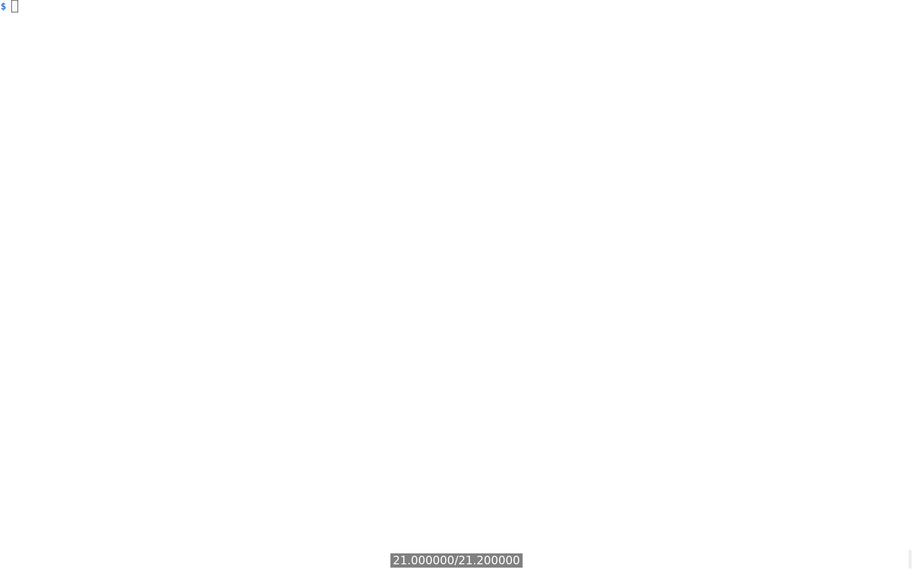

[Table of Contents](../../../README.md) | [&larr; GraphQL](../docs/GRAPHQL.md) | [gRPC &rarr;](../../grpc/README.md)

## Web Feeds

The following is the supplementary content to the Web Feeds chapter.

### Requirements

* [Docker Engine](https://docs.docker.com/engine/install/) or [Docker Desktop](https://docs.docker.com/desktop/)
* [Docker Compose](https://docs.docker.com/compose/install/)

### Lab Setup

The following steps create three Docker containers: `django-app`, `django-postgres`, and `django-redis`.
These steps need to be executed only once.

```bash
cd src/django
docker compose build --build-arg UID=$(id -u) --build-arg GID=$(id -g)
docker compose up --detach --wait
```

<details>
<summary>Show the above example as an animated GIF</summary>

[](https://youtu.be/oA9Y07YiBdo)

</details>

Visit app at [http://localhost:8000](http://localhost:8000)

> [!WARNING]
> When working with GitHub Codespaces, you'll use a unique URL containing the Codespace's name instead of the localhost URL.

### Inspecting the WFS' Web Feed

To test the WFS web feed, you need to have the lab environment running.
The following example shows an Atom web feed for the WFS.
The `curl` command is used to get the Atom feed, and the `xmllint` command is used to pretty print the feed.

The feed is an XML document representing an Atom feed, a format used for web syndication.
This specific feed provides weather forecasts for different cities.

The root element, `<feed>`, declares the Atom namespace and language.
It contains metadata elements like the feed's title, alternate and self links (both pointing to the forecast feed), a unique ID, the last update timestamp, and a subtitle.

The `<entry>` element represents a single forecast item, which contains a title (city name), an alternate link (pointing to a specific forecast for the city), a unique ID for the entry, and a summary containing the city's name, country, and continent.
The `type="html"` attribute in the `<summary>` tag indicates that the content is HTML-formatted.

```bash
# Get the Atom feed and pretty print it
docker compose exec app bash -c "curl --silent http://localhost:8000/forecast/feed | xmllint --format -"

<?xml version="1.0" encoding="utf-8"?>
<feed xmlns="http://www.w3.org/2005/Atom" xml:lang="en-us">
  <title>City Weather Forecast</title>
  <link href="http://localhost:8000/forecast/feed" rel="alternate"/>
  <link href="http://localhost:8000/forecast/feed" rel="self"/>
  <id>WFS weather feed</id>
  <updated>2025-05-06T18:21:17.270165+00:00</updated>
  <subtitle>One week forecast</subtitle>
  <entry>
    <title>Cairo</title>
    <link href="http://localhost:8000/forecast/2e5d2f5b-83c6-433f-b7cb-8e89a9e92d39" rel="alternate"/>
    <id>http://localhost:8000/forecast/2e5d2f5b-83c6-433f-b7cb-8e89a9e92d39</id>
    <summary type="html">Cairo, Egypt, Africa</summary>
  </entry>
  ...
</feed>
```

### Reading the WFS' Web feed using `newsboat`

The web feed is implemented using Django REST Framework.
The following example shows how to read the Atom feed using the [newsboat](https://newsboat.org/index.html) program.

```bash
# Get Atom feed
docker compose exec app bash -c \
       "mkdir --parents ~/.newsboat && \
       echo http://localhost:8000/forecast/feed > ~/.newsboat/urls"

# Read the feed
docker compose exec app bash -c \
       "newsboat --refresh-on-start --execute=reload --execute=print-unread"

6 unread articles
```

<details>
<summary>Show the above example as an animated GIF</summary>

[](https://youtu.be/3OWbTeJqysk)

</details>

### Lab Teardown

The following command stops and removes the Docker containers created in the [lab setup](#lab-setup) step.

```bash
docker compose down
```

[Table of Contents](../../../README.md) | [&larr; GraphQL](../docs/GRAPHQL.md) | [gRPC &rarr;](../../grpc/README.md)