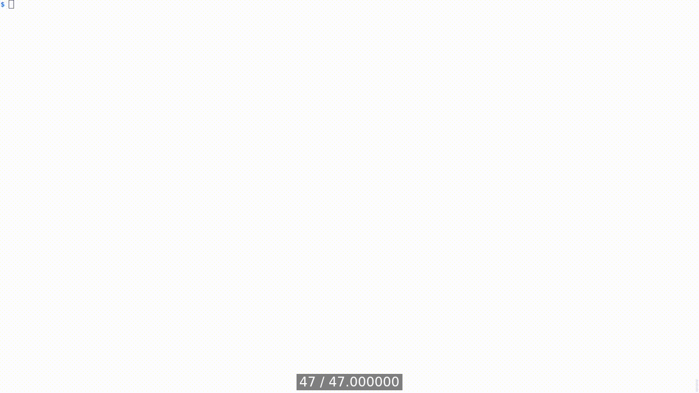

[Table of Contents](../../../README.md) | [&larr; gRPC](../../grpc/README.md) | [WebSocket &rarr;](../../django/docs/WEBSOCKET.md)

## Webhooks

The following is the supplementary content to the Webhooks chapter.
The examples in this chapter show how to work with the WFS' Webhook APIs.

### Requirements

* [Docker Engine](https://docs.docker.com/engine/install/) or [Docker Desktop](https://docs.docker.com/desktop/)
* [Docker Compose](https://docs.docker.com/compose/install/)

### Lab Setup

The setup steps in this section are executed relative to the root of the book's code repository and must be performed only once.
These steps will create three Docker containers: `django-app`, `django-postgres`, and `django-redis`.

```bash
cd src/django
docker compose build --build-arg UID=$(id -u) --build-arg GID=$(id -g)
docker compose up --detach --wait
```

<details>
<summary>Show the above example as an animated GIF</summary>

[](https://youtu.be/oA9Y07YiBdo)

</details>

Visit app at [http://localhost:8000](http://localhost:8000)

> [!IMPORTANT]
> When working with GitHub Codespaces, you'll use a unique URL containing the Codespace's name instead of the localhost URL.

### Testing

The following example demonstrates testing of two webhook implementations.
The `app_event` command sends a test event to the webhook endpoint.
The `--callback-url` option specifies the URL to which the event is sent, and the `--payload` option specifies the event data.
Both implemented endpoints, _v1_ and _v2_, work the same way.
A client sends a POST request to the webhook URL with a JSON payload.
The server processes the request and returns a response.
The response is then printed to the console.

```bash
# Set environment variables
EPOCH=$(date +%s)
PAYLOAD='{"type":"dummy.event", "timestamp":'$EPOCH', "data":{"echo":"test"}}'

# Execute v1 endpoint test <1>
docker compose exec app bash -c \
       "python manage.py app_event \
       --callback-url webhook/v1/echo \
       --payload '$PAYLOAD'"

# Output:
POST webhook/v1/echo
{"type":"dummy.event","timestamp":1709111631,"data":{"echo":"test"}}

# Execute v2 endpoint test <2>
docker compose exec app bash -c \
       "python manage.py app_event \
       --callback-url webhook/v2/echo \
       --payload '$PAYLOAD'"

POST webhook/v2/echo
{"type":"dummy.event","timestamp":1709111631,"data":{"echo":"test"}}
```

1. The implementation of this endpoint takes advantage of the [standardwebhooks](https://pypi.org/project/standardwebhooks/) library that follows the [standardwebhooks.com](https://www.standardwebhooks.com/) specification.

2. The implementation of this endpoint is manual, but still follows the [standardwebhooks.com](https://www.standardwebhooks.com/) specification.

<details>
<summary>Show the above example as an animated GIF</summary>

[](https://youtu.be/-WX8exPxA-I)

</details>

### Lab Teardown

The following command stops and removes the Docker containers created in the [lab setup](#lab-setup) step.

```bash
docker compose down
```

[Table of Contents](../../../README.md) | [&larr; gRPC](../../grpc/README.md) | [WebSocket &rarr;](../../django/docs/WEBSOCKET.md)
