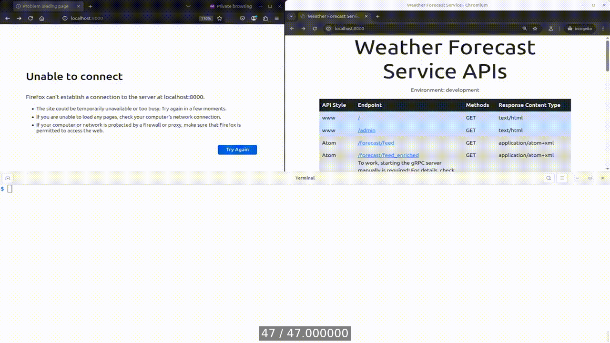
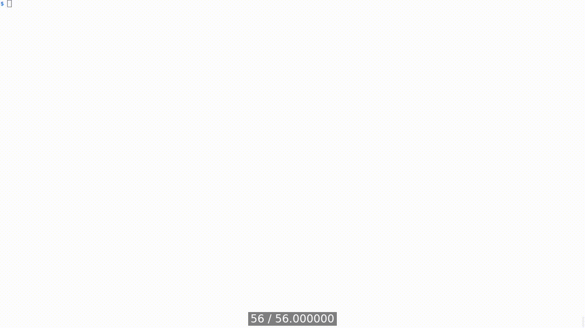

[Table of Contents](../../../README.md) | [&larr; Webhooks](../docs/WEBHOOKS.md) | [Messaging &rarr;](../../rabbitmq/README.md)

## WebSocket

The following is the supplementary content to the WebSocket chapter.
The examples in this chapter show how to work with the WFS' WebSocket APIs.

### Requirements

* [Docker Engine](https://docs.docker.com/engine/install/) or [Docker Desktop](https://docs.docker.com/desktop/)
* [Docker Compose](https://docs.docker.com/compose/install/)
* [Wireshark](https://www.wireshark.org/) or [tshark](https://www.wireshark.org/docs/wsug_html_chunked/AppToolstshark.html)

### Lab Setup

The setup steps in this section are executed relative to the root of the book's code repository and must be performed only once.
These steps will create three Docker containers: `django-app`, `django-postgres`, and `django-redis`.

```bash
cd src/django
docker compose build --build-arg UID=$(id -u) --build-arg GID=$(id -g)
docker compose up --detach --wait
```

<details>
<summary>Show the above example as an animated GIF</summary>

[](https://youtu.be/t5_mYKGnQsg)

</details>

Visit app at [http://localhost:8000](http://localhost:8000)

> [!IMPORTANT]
> When working with GitHub Codespaces, you'll use a unique URL containing the Codespace's name instead of the localhost URL.

### Inspecting WebSocket protocol with Wireshark

This example shows captured with Wireshark traffic between the WebSocket client and server.
The JavaScript client code is downloaded by the browser from the Django server located at [http://localhost:8000/ws/v1/echo](http://localhost:8000/ws/v1/echo).
Note that the connection is unencrypted, and the WebSocket protocol is visible in the captured packets.
An encrypted WebSocket connection is described in the security section.

<details>
<summary>Show the above example as an animated GIF</summary>

[](https://youtu.be/d36k7D54lNU)

</details>

### WFS Alerting

The following example shows how to send an alert message to WebSocket clients.
The alert message is sent using the `app_alert` command.
The command takes two arguments: the `--city-uuid`, which is the UUID of the city to which the alert message is sent, and the `--message` argument that describes the alert message.

To demonstrate that alerting works, two WebSocket clients (Firefox and Chrome web browsers) receive alerts from the WebSocket server.

> [!WARNING]
> Remember to adjust the `UUID` of the city to match the UUID of the city you use in your local environment.

```bash
# Get UUID of the first city
CITY_UUID=$(docker compose exec app python manage.py app_cities | head -n 1 | cut -d' ' -f 2)

# Issue an alert message
docker compose exec app python manage.py app_alert --city-uuid=$CITY_UUID --message 'Hail storm is coming!'
```

<details>
<summary>Show the above example as an animated GIF</summary>

[](https://youtu.be/BSFl5UVx2xA)

</details>

### Security

This section demonstrates WebSocket encryption.

#### Transport Layer Security

The following example shows how to set up and test TLS encryption for WebSocket.
The example uses a client (JavaScript client code downloaded by the browser from the Django server at port _8000_) that sends an _"echo"_ message to the WebSocket server (port _8001_) and receives the message back.

To enable TLS in the local environment edit _src/django/compose.yaml_ to set `TLS_ENABLE` environment variable to `1`, and restart the Docker containers.
An encrypted WebSocket connection is visible in the browser as the `wss://` protocol.

```bash
# Enable TLS
sed --in-place 's/- TLS_ENABLE=0/- TLS_ENABLE=1/g' compose.yaml

# Restart containers
docker compose up --detach --wait
```

<details>
<summary>Show the above example as an animated GIF</summary>

[](https://youtu.be/Br-0rJebtjc)

</details>

> [!IMPORTANT]
> When working in GitHub Codespaces, you need to change the visibility of WebSocket server port 8001 to Public, and disable TLS by setting the +TLS_ENABLE+ variable to +0+ (_src/django/compose.yaml_).
> TLS in GitHub Codespaces comes out of the box.
> 
> When visiting _https://localhost:8000_ locally (not in GitHub Codespaces), the browser will display a warning: "Your connection is not private" in Chrome and "Warning: Potential Security Risk Ahead" in Firefox.
> To interact with the WFS web page, add the application's self-signed SSL certificate to the browser's exception list.
> To do this, visit _https://localhost:8000_ as well as _https://localhost:8001_, and depending on what web browser you are using, click "Proceed to localhost (unsafe)" in Chrome or "Accept the risk and continue" in Firefox.

### Documentation

The following example shows how to generate documentation for the WebSocket API using [AsyncAPI](https://www.asyncapi.com).
The AsyncAPI documentation is generated as an HTML file from the _src/django/docs/api/websocket/v1-schema.yaml_ file.
The generated documentation is available in the _src/django/docs/api/websocket/output_ directory.

```bash
# Change the location to the directory that contains the AsyncAPI schema
cd src/django/docs/api/websocket

# Generate HTML documentation using the _asyncapi/cli_ Docker image
docker run --rm -it --user=root \
       --volume ${PWD}/output:/app/output \
       --volume ${PWD}/v1-schema.yaml:/app/asyncapi.yaml \
       asyncapi/cli generate fromTemplate /app/asyncapi.yaml \
       @asyncapi/html-template@3.0.0 \
       --force-write --use-new-generator --output /app/output

# Serve the generated HTML documentation using the Nginx web server
docker run --rm --detach --publish 127.0.0.1:8888:80 \
       --volume ${PWD}/output:/usr/share/nginx/html:ro nginx
```

<details>
<summary>Show the above example as an animated GIF</summary>

[](https://youtu.be/NDokpW5TfhI)

</details>

### Lab Teardown

The following command stops and removes the Docker containers created in the [lab setup](#lab-setup) step.

```bash
docker compose down
```

[Table of Contents](../../../README.md) | [&larr; Webhooks](../docs/WEBHOOKS.md) | [Messaging &rarr;](../../rabbitmq/README.md)