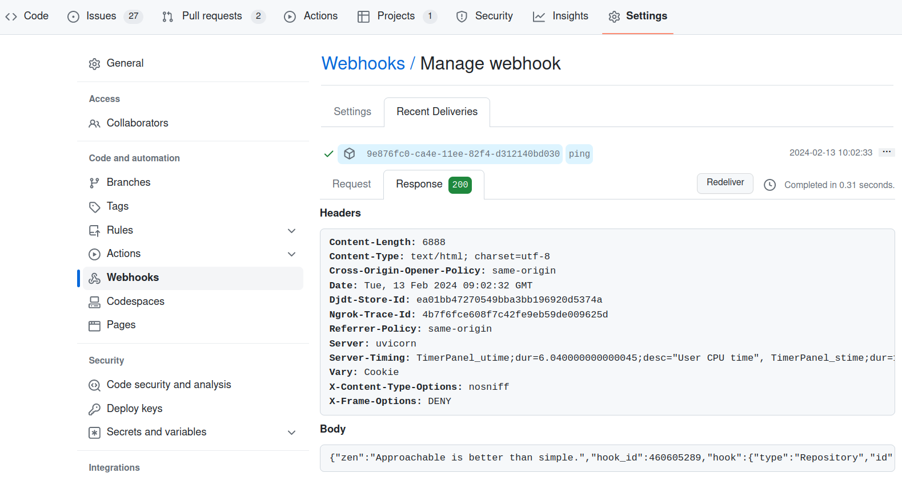

# Exercise 1

Implement incoming webhooks between WFS and [github.com](https://github.com). Your task is to fork the repository of this book and create a webhook that will notify the WFS _/webhook/v3/echo_ endpoint about any event that happens to the forked repository. Hint: to solve this exercise, use [ngrok](https://ngrok.com) CLI to expose the local server, which is the destination of the webhook to the Internet.

## Solution

1. Fork the repository of this book.
2. In forked repository create GitHub's Codespaces. *This step will take several minutes.*
3. Run the WFS server with. The following command will build the WFS server and run it in the background.
    ```bash
    # Change the directory
    cd src/django/

    # Build the WFS server
    docker compose build --build-arg USER=$(id -u) --build-arg GROUP=$(id -g)

    # Wait until django-app container is in healthy state
    docker compose up --detach
    ```
4. Register an account in [ngrok.com](https://ngrok.com) and visit [dashboard.ngrok.com](https://dashboard.ngrok.com/get-started/your-authtoken) to obtain authentication token. Add token to the ngrok CLI.
  ```bash
  ngrok config add-authtoken  <AUTHTOKEN>
  ```
5. Expose the WFS server to the internet using `ngrok` CLI, and copy forwarding URL.
    * *If you ran WSF in with TLS enabled then change http to https*
    * *The `Forwarding URL` will be different for you!*

    ```bash
    ngrok http 8000

    ngrok                         (Ctrl+C to quit)
    Session Status                online
    Account                       username (Plan: Free)
    Version                       3.6.0
    Region                        Europe (eu)
    Latency                       8ms
    Web Interface                 http://127.0.0.1:4040
    Forwarding                    https://c744-172-211-81-17.ngrok-free.app -> http://localhost:8000
    ```

6. Check that webhook endpoint is working. The following command will send a test payload to the WFS server.
    ```bash
    curl -k -X POST "https://c744-172-211-81-17.ngrok-free.app/webhook/v3/echo" -H "Content-Type: application/json" -d '{"test": "webhook"}'; echo
    {"test": "webhook"}
    ```
7. Go to webhook settings of the forked repository (https://github.com/YOUR_USERNAME/learning-api-styles-book/settings/hooks/new), and create a new webhook.
    * Payload URL: https://c744-172-211-81-17.ngrok-free.app/webhook/v3/echo
    * Content type: application/json
    * Secret: leave empty
    * SSL verification: Enable SSL verification
    * Which events would you like to trigger this webhook?: Send me everything.

8. Creation new webhook will result with a ping request being sent to the WFS server. The WFS server will respond with a 200 OK status code and the content of ping request.
    

# Exercise 2

In the custom implementation of webhook we manually created the HMAC signature in Python. Now, the task is to implement webhook's HMAC signature but as a shell script. Once you'll have the signature create *`curl`* command that sends POST data to `/webhook/v1/echo` and `/webhook/v2/echo` endpoints.

## Solution

```bash
#!/usr/bin/env bash

# https://github.com/standard-webhooks/standard-webhooks/blob/main/spec/standard-webhooks.md
# Note: while it's OK (and recommended) to minimize the JSON body when serialized for sending,
# it's important to make sure that the payload sent is the same as the payload signed.
# Cryptographic signatures are sensitive to even the smallest changes, and even a stray space can cause the signature to be invalid.
# This is a very common failure mode as many webhook consumers often accidentally parse the body as json, and then serialize it again,
# which can cause for failed verification due to minor changes in serialization of JSON (which is not necessarily the same across implementations,
# or even multiple invocations of the same implementation).

set -Eeuo pipefail

# Set the variables
ENDPOINT_V1="webhook/v1/echo"
ENDPOINT_V2="webhook/v2/echo"
WEBHOOK_ID="123abc"
PAYLOAD_TIMESTAMP=$((2**31))
WEBHOOK_TIMESTAMP=$(date +%s)
WEBHOOK_PAYLOAD="{\"type\": \"dummy_event.created\", \"timestamp\": ${PAYLOAD_TIMESTAMP}, \"data\": {\"echo\": \"test\"}}"
WEBHOOK_SECRET=$WEBHOOK_SECRET

# Create standard webhook signature scheme
SIG_SCHEME="${WEBHOOK_ID}.${WEBHOOK_TIMESTAMP}.${WEBHOOK_PAYLOAD}"

# Create the HMAC using SHA256
SIGNATURE=$(echo -n $SIG_SCHEME | openssl dgst -sha256 -hmac $WEBHOOK_SECRET -binary)

# Encode the signature in base64. For long signature in Linux use base64 -w0
SIGNATURE_B64=$(echo -n $SIGNATURE | base64)

# Create the standard webhook signature
STANDARD_WEBHOOK_SIGNATURE="v1,$SIGNATURE_B64"

# Sent POST request to $ENDPOINT_V1 Received below response
curl \
  -d "$WEBHOOK_PAYLOAD" \
  -H "Content-Type: application/json" \
  -H "webhook-id: $WEBHOOK_ID" \
  -H "webhook-signature: $STANDARD_WEBHOOK_SIGNATURE" \
  -H "webhook-timestamp: $WEBHOOK_TIMESTAMP" \
  -X POST \
  "http://localhost:8000/$ENDPOINT_V1"
echo
echo

# Sent POST request to $ENDPOINT_V2 Received below response
curl \
  -d "$WEBHOOK_PAYLOAD" \
  -H "Content-Type: application/json" \
  -H "webhook-id: $WEBHOOK_ID" \
  -H "webhook-signature: $STANDARD_WEBHOOK_SIGNATURE" \
  -H "webhook-timestamp: $WEBHOOK_TIMESTAMP" \
  -X POST "http://localhost:8000/$ENDPOINT_V2"
echo
```