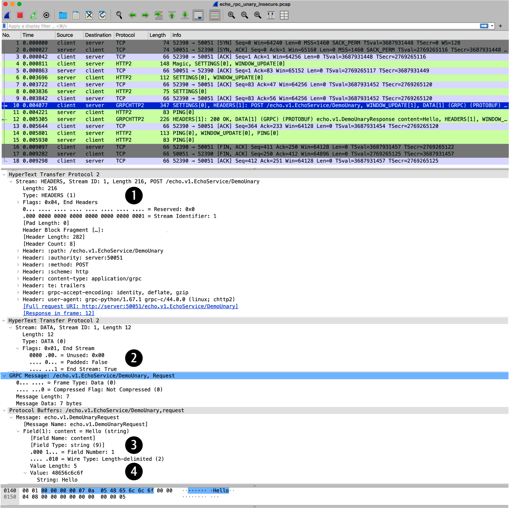

[Table of Contents](../../README.md) | [&larr; Web Feed](../django/docs/WEB-FEEDS.md) | [Webhooks &rarr;](../django/docs/WEBHOOKS.md)

## gRPC

The following is the supplementary content to the gRPC chapter.

### Requirements

* [Docker Engine](https://docs.docker.com/engine/install/) or [Docker Desktop](https://docs.docker.com/desktop/)
* [Docker Compose](https://docs.docker.com/compose/install/)
* Optionally [Wireshark](https://www.wireshark.org/)
* Optionally [screen](https://www.gnu.org/software/screen/) on Linux or MacOS

### gRPC Lab Setup

The setup steps in this section are to be executed once, starting from the root of the book's code repository.
The script creates two Docker containers, the `client` and the `server`.

```bash
cd src/grpc
bash scripts/setup_containers.sh
```

<details>
<summary>Show the above example as an animated GIF</summary>

[](https://youtu.be/ouy575s59l0)

</details>

### gRPC Echo Server and Client

RPC stands for Remote Procedure Call. As the name suggests, RPC API style focuses on interaction with APIs by invoking remote procedures (functions).
The project was created by Google, and in 2017, it was donated to the Cloud Native Computing Foundation, which hosts it at [https://grpc.io](https://grpc.io).

gRPC uses [Protocol buffers](https://protobuf.dev), called _protobuf_ for short, as the default serialization format.[^1]
Protocol buffers are also used by gRPC as the Interface Definition Language (IDL) to describe the API by defining the RPC methods and their request/response messages.
Protobuf definitions are stored in human-readable _.proto_ files.
The message data structures in these files are compiled into a binary format, which, compared to text, improves storage size and parsing performance.

A complete example of a protobuf definition of an RPC method is included below.
It contains the _EchoService_, which in turn includes a single _DemoUnary_ RPC.
The _DemoUnary_ RPC is invoked by the client using the _DemoUnaryRequest_ message, and is executed on the server.
The server echoes the content of the received request back to the client as the _DemoUnaryResponse_.

```proto
syntax = "proto3"; // <1>
package echo.v1; // <2>

message DemoUnaryRequest { // <3>
  // The text content of the request. // <4>
  string content = 1; // <5>
}

message DemoUnaryResponse { // <6>
  // The text content of the response.
  string content = 1;
}

// The service echoes back the content received from the client. // <7>
service EchoService { // <8>
  // This method demonstrates unary RPC.
  rpc DemoUnary(DemoUnaryRequest) returns (DemoUnaryResponse); // <9>
}
```

1. This protobuf uses the currently latest protocol buffers version.

2. To help in communicating changes made to the protobuf definition, protocol buffers have a built-in support for versioning.
Here, the `echo` package is assigned version `v1`.

3. This block defines the request message.
Protobufs are designed for evolution, therefore for flexibility of making future modifications, it's recommended to separately define the request and response message for every RPC.[^2]
The common naming convention is to append the RPC name with the `Request` and `Response` suffix.

4. Lines starting with `"//"` are treated by protobuf as comments.
The protobuf files serve as your API documentation, written as comments.
This example comment is redundant in the sense that it could be guessed from the code surrounding it, but it's left here to remind you to document protobufs.[^3]

5. The request message uses the string type named `content` as the first field.
The field numbers, like `1` here, mustn't be reused within the given message.

6. This block defines the response message.
Both the request and response messages consist of a single string type field, yet they are defined as separate messages to facilitate future changes.
An alternative approach, which is sometimes seen in gRPC tutorials, but discouraged from the perspective of protobuf evolution, would be to define a single message, `DemoUnaryMessage`, instead of separate `DemoUnaryRequest`, and `DemoUnaryResponse` messages.

7. The comment lines present above the service and RPC method definitions will be included in the autogenerated service documentation.

8. This block defines the gRPC service.
A service may contain multiple RPCs.

9. Lines starting with `rpc` define RPC methods.
An RPC represents an action, and its name typically starts with a verb.
Any RPC method accepts and returns only a single argument (a message).
However, a message can contain many fields, messages can be nested, and use other message types as fields.

The _protoc_ protobuf compiler, taking the protobuf file as an input, generates a source code used as the base to implement the gRPC client and server.

```bash
docker compose exec client bash -ci \
       "cd src/echo && \
       python -m grpc_tools.protoc \
       --proto_path=echo/proto/echo/v1=echo/proto/echo/v1 \
       --python_out=. --grpc_python_out=. \
       echo/proto/echo/v1/echo.proto"
```

The code generation will produce two files, chosen here to be located in the same directory as the _echo.proto_ file.

- _echo_pb2.py_—This file contains the binary data structure, and metadata for messages, service, and RPC methods.

- _echo_pb2_grpc.py_—This file contains so-called stub code, for both the gRPC client and server, and additional code to facilitate creation of the gRPC server.

> [!NOTE]
> gRPC stubs serialize and deserialize messages and provide an interface for invoking RPCs.

Both the server and client code is written by you, the developer, and is based on the autogenerated code.
In this README, we won't discuss this implementation, and instead only demonstrate a functioning unary RPC, by executing the commands below.

```bash
# In a terminal run <1>
tmux new-session \; split-window -v \;

# In the top pane run <2>
SECURITY=insecure
docker compose exec server bash -ci \
       "PYTHONPATH=./src/echo python src/echo/echo/server.py ${SECURITY}"

# In the bottom pane run <3>
RPC=unary SECURITY=insecure
docker compose exec client bash -ci \
       "PYTHONPATH=./src/echo python src/echo/echo/client.py ${RPC} ${SECURITY}"

# Output:
Client request: Hello, Serialized message: 0a0548656c6c6f
Server response: Hello
```

1. Create three panes with tmux.

2. Start the gRPC server.
This demonstration sets the `SECURITY=insecure` environment variable to disable mutual TLS (mTLS).

3. Invoke the gRPC client.
The client sends "Hello" text to the server, which responds by echoing this content back to the client.
The hexadecimal value `0a0548656c6c6f` contains the bytes of the request message serialized using protobuf.

<details>
<summary>Show the above example as an animated GIF</summary>

[](https://youtu.be/D0b3rBVEb3I)

</details>

The figure below illustrates the packet capture of unary RPC loaded in the [Wireshark GUI](https://www.wireshark.org), with the highlighted request packet number 10, which is further explained in the book.

<div align="center">
  
</div>

### The Four RPC Types

This section demonstrates the remaining RPC types supported by gRPC, in addition to unary RPC: server streaming, client streaming, and bidirectional streaming.[^4]

<details>
<summary><strong>Server Streaming RPC</strong></summary>

The demo below shows server streaming RPC, where the client sends a request to the server and gets a stream of messages in response.
The client reads from the stream until no more messages are left to be read.

The example below shows the client sending a _"Hello"_ message to the server.
The server responds with a stream of individual letters of "Hello".

```bash
# In a terminal run
tmux new-session \; split-window -v \; split-window -v \;

# In the top pane run
SECURITY=insecure
docker compose exec server bash -ci \
       "PYTHONPATH=./src/echo python src/echo/echo/server.py ${SECURITY}"

# In the middle pane run
RPC=server_streaming SECURITY=insecure
PCAP_FILE=/tmp/echo_rpc_${RPC}_${SECURITY}.pcap
docker compose exec client bash -c \
       "sudo rm -f ${PCAP_FILE} && \
       sudo tcpdump -w ${PCAP_FILE} 'port 50051' && \
       cp ${PCAP_FILE} tests"

# In the bottom pane run
RPC=server_streaming SECURITY=insecure
docker compose exec client bash -ci \
       "PYTHONPATH=./src/echo python src/echo/echo/client.py ${RPC} ${SECURITY}"
```

[](https://youtu.be/BW1_CEPLDt0)

</details>

<details>
<summary><strong>Client Streaming RPC</strong></summary>

The following example is analogous to the above server streaming RPC, but in this case, the client sends a stream of messages to the server (one message per letter in the _"Hello"_ word).
The server reads the stream until it reaches the end of the client stream, assembles the messages, and sends a single response back (assembled "Hello" word) to the client.

```bash
# In a terminal run
tmux new-session \; split-window -v \; split-window -v \;

# In the top pane run
SECURITY=insecure
docker compose exec server bash -ci \
       "PYTHONPATH=./src/echo python src/echo/echo/server.py ${SECURITY}"

# In the middle pane run
RPC=client_streaming SECURITY=insecure
PCAP_FILE=/tmp/echo_rpc_${RPC}_${SECURITY}.pcap
docker compose exec client bash -c \
       "sudo rm -f ${PCAP_FILE} && \
       sudo tcpdump -w ${PCAP_FILE} 'port 50051' && \
       cp ${PCAP_FILE} tests"

# In the bottom pane run
RPC=client_streaming SECURITY=insecure
docker compose exec client bash -ci \
       "PYTHONPATH=./src/echo python src/echo/echo/client.py ${RPC} ${SECURITY}"
```

[](https://youtu.be/fnV7QOH9SG0)

</details>

<details>
<summary><strong>Bidirectional Streaming RPC</strong></summary>

The next example shows bidirectional streaming RPC, where the client and server exchange messages over a stream in both directions.
The word _"Hello"_ is split into individual letters.

```bash
# In a terminal run
tmux new-session \; split-window -v \; split-window -v \;

# In the top pane run
SECURITY=insecure
docker compose exec server bash -ci \
       "PYTHONPATH=./src/echo python src/echo/echo/server.py ${SECURITY}"

# In the middle pane run
RPC=bidirectional_streaming SECURITY=insecure
PCAP_FILE=/tmp/echo_rpc_${RPC}_${SECURITY}.pcap
docker compose exec client bash -c \
       "sudo rm -f ${PCAP_FILE} && \
       sudo tcpdump -w ${PCAP_FILE} 'port 50051' && \
       cp ${PCAP_FILE} tests"

# In the bottom pane run
RPC=bidirectional_streaming SECURITY=insecure
docker compose exec client bash -ci \
       "PYTHONPATH=./src/echo python src/echo/echo/client.py ${RPC} ${SECURITY}"
```

[](https://youtu.be/_VNJ73cS6m4)

</details>

### Protobuf Wire Format

The hexadecimal value `0a0548656c6c6f`, included earlier in the unary RPC output, is an example of the protobuf wire format.
To further explain this format, let's separate the components identified in our example by spaces `0a 05 48656c6c6f`.
This type of representation is called [tag-length-value](https://en.wikipedia.org/wiki/Type%E2%80%93length%E2%80%93value).
The tag in the protobuf wire format is composed of the _field number_ and the _wire type_, following the formula _(field_number << 3) | wire_type_, with _<<_ denoting the binary shift-left by three positions.
This means the lowest (the rightmost) three bits denote the wire type, and the rest of the bits denote the field number.

In our example, the tag is one byte long, and equals to `0a` in hexadecimal (`10` in decimal).
Using Python's Read, Evaluate, Print, Loop (REPL) block below, you can arrive at this value by following the protobuf tag formula.
You need to use the following values of the field number and wire type:

1. Our protobuf sets the `content` field number to 1, and its type to string.
2. In the protobuf [message structure](https://protobuf.dev/programming-guides/encoding/#structure) table, you find that the string type corresponds to the wire type numerical id of 2.

> [!TIP]
> The Python's REPL can be started with **`docker compose exec client python`**, and stopped by typing **`exit()`** followed by _ENTER_.

```python
>>> field_number = 1
>>> wire_type = 2
>>> tag = (field_number << 3) | wire_type
>>> print(tag)
10
>>> print(f"{tag:02x}")
0a
```

<details>
<summary>Show the above example as an animated GIF</summary>

[](https://youtu.be/fdbRrzoCeqc)

</details>

The message structure table[^5] below shows several other protobuf wire types used by gRPC, in particular _VARINT_.
The table contains the wire type id, its name, and the types of fields it can be used for.

| ID | Name | Used For |
|---|---|---|
| 0 | VARINT | int32, int64, uint32, uint64, sint32, sint64, bool, enum |
| 1 | I64 | fixed64, sfixed64, double |
| 2 | LEN | string, bytes, embedded messages, packed repeated fields |
| 3 | SGROUP | group start (deprecated) |
| 4 | EGROUP | group end (deprecated) |
| 5 | I32 | fixed32, sfixed32, float |

The varint type, as the name suggests, represents integers using a variable length.
Such representation is space-efficient for small integers.
The protobuf wire format uses varints to represent not only messages' values, but also the tag and length of the value itself.
In our example, the decimal number 10 requires one byte of storage, instead of a common 64-bit (8-byte) fixed-length representation.
Both the `0a` tag and the `05` length of the "Hello" string, encountered in our example, are one-byte long varints.

To practice the mechanics of longer varints, let's manually encode a protobuf wire format that contains two-byte long varints.
This can be achieved by modifying the _src/echo/echo/proto/echo/v1/echo.proto_ file to use field number, e.g., 150 instead of 1, autogenerating the code with the protoc compiler, and modifying the _src/echo/echo/client.py_ file to send a request consisting of the "Hello" string repeated 30 times, resulting in a length of 150.
The client will print the serialized message `b2099601` in hexadecimal, that is `b209`, followed by `9601`, followed by `48656c6c6f` repeated 30 times.
The output of the protoc compiler, shown in the code block below, confirms that this wire format corresponds to the above description.

```bash
docker compose exec client bash -ci \
       "(printf 'b2099601' && printf '48656c6c6f''%.0s' {1..30}) | \
       xxd -plain -revert | \
       python -m grpc_tools.protoc --decode_raw"

150: "HelloHelloHello..." # "Hello" repeated 30 times
```

Each byte in the varint has a _continuation bit_ as the _most significant bit_ (MSB), which, if set, indicates that another byte of the varint follows.
The lower 7 bits in the varint byte provide the payload—hence the protobuf varints are _base 128_.
If a varint is composed of multiple bytes, they are concatenated in the _Little-Endian_ order.

> [!NOTE]
> A Big-Endian system stores the most significant byte (the "big" end) at the biggest memory address (beginning of a word), and a Little-Endian system stores the least significant byte (the "little" end) at the smallest memory address (end of a word), respectively.
>
> The Big-Endian format aligns with how humans represent numbers in writing.
> The most significant (big) digit is read first, and the least significant digit (small) last.
>
> The Big-Endian order is often used in networking and known as _network order_.
> The Little-Endian order is used by most computer processor architectures, like x86 or ARM.

The block below shows the process of manually encoding the tag into varint `b209` in hexadecimal, using Python's REPL.

```python
>>> field_number = 150
>>> wire_type = 2
>>> tag = (field_number << 3) | wire_type  # <1>
>>> print(tag)
1202
>>> tag_bin = f"{tag:014b}"  # <2>
>>> print(tag_bin)
00010010110010

>>> big, little = tag_bin[:7], tag_bin[-7:]  # <3>
>>> print(little, big)
0110010 0001001

>>> print("1" + little, "0" + big)  # <4>
10110010 00001001

>>> varint = "1" + little + "0" + big  # <5>
>>> print(varint, f"{int(varint, 2):04x}")
1011001000001001 b209
```

1. Calculate the tag value, `1202` in decimal, following the protobuf tag formula.

2. Represent the tag value as a 14-bit binary number.

3. Split the binary number into two 7-bit numbers.
Your machine most likely uses Little-Endian order internally, but Python displays the number in a human-readable format, with the most significant (big) digit on the left.

4. Switch the order to Little-Endian, required by varints.
Then set the continuation bit `1` on the little end, and unset the continuation bit on the big end.

5. Concatenate the two bytes, arriving at `b209` varint in hexadecimal.

### Lab Teardown

After the lab from this chapter is no longer needed, the containers can be stopped, and removed.

```bash
bash scripts/teardown_containers.sh
```

### Testing

The full functionality, including the lab setup and teardown, can be tested using the provided script.
It uses the [screen](https://www.gnu.org/software/screen/) to execute commands in the background.

Tests for unary, server_streaming, client_streaming, and bidirectional_streaming are included, and they can be executed either without or with traffic encryption (using mTLS).

```bash
bash tests/echo.sh unary mtls
```

[Table of Contents](../../README.md) | [&larr; Web Feed](../django/docs/WEB-FEEDS.md) | [Webhooks &rarr;](../django/docs/WEBHOOKS.md)

[^1]: The main goal of protocol buffers as a standalone technology is to provide data serialization mechanisms. gRPC is also designed to support other serialization formats, including JSON.

[^2]: See [Create Unique Protos per Method](https://web.archive.org/web/20250721031945/https://protobuf.dev/best-practices/api/#unique-protos) for more details about this recommendation. Furthermore, it's also recommended to place every message in a [separate file](https://protobuf.dev/best-practices/dos-donts/#separate-files), but this recommendation is not followed here for readability.

[^3]: See [Precisely, Concisely Document Most Fields and Messages](https://web.archive.org/web/20250721031945/https://protobuf.dev/best-practices/api/#precisely-concisely).

[^4]: For more details about RPC supported by the gRPC, see [gRPC core concepts](https://grpc.io/docs/what-is-grpc/core-concepts/) documentation.

[^5]: For more details about protobuf wire format, see [Protobuf Encoding](https://protobuf.dev/programming-guides/encoding/).
