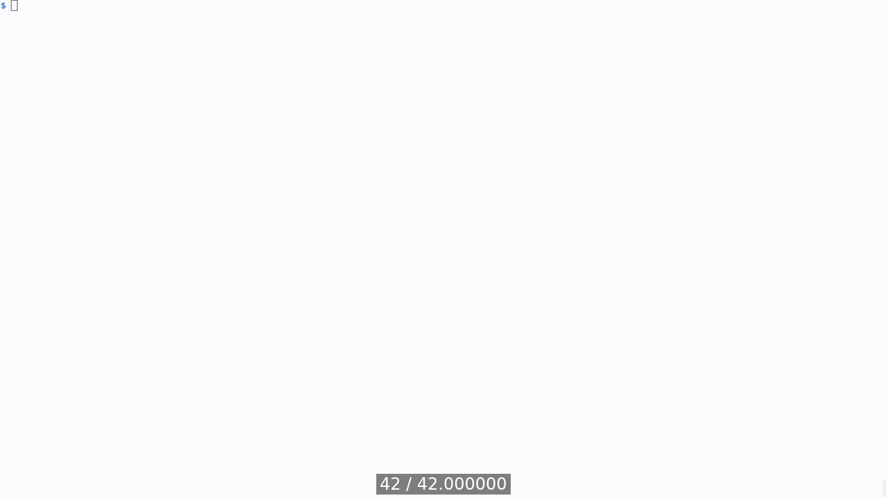
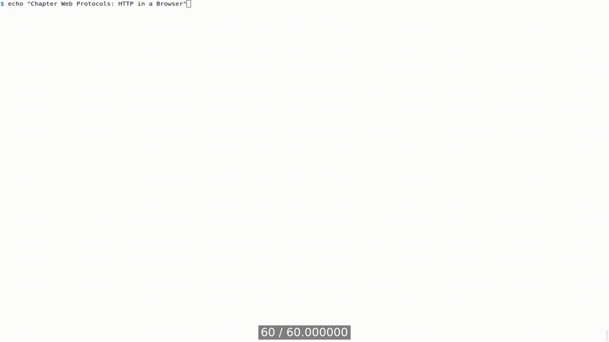
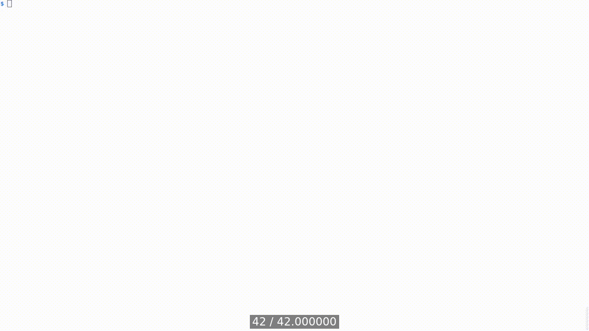
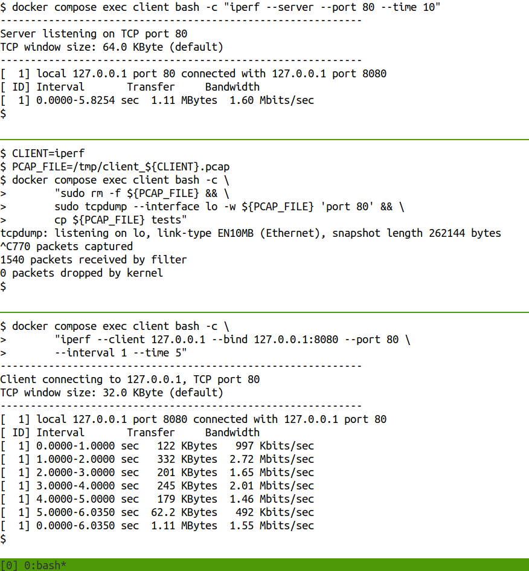
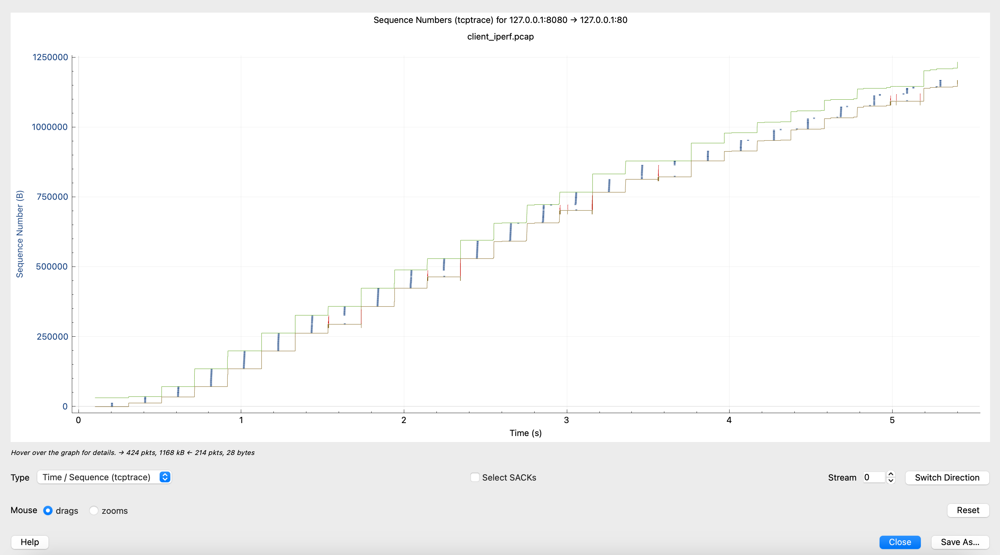
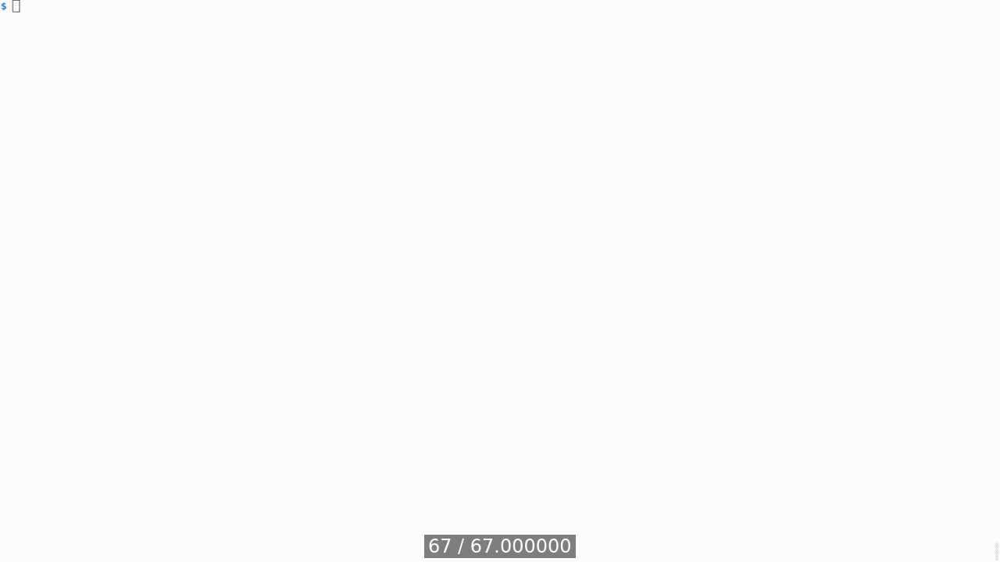

[Table of Contents](../../README.md) | [&larr; Network](../network/README.md) | [REST &rarr;](../django/docs/REST.md)

## Web Protocols

The following is the supplementary content to the Web Protocols chapter.

### Requirements

* [Docker Engine](https://docs.docker.com/engine/install/) or [Docker Desktop](https://docs.docker.com/desktop/)
* [Docker Compose](https://docs.docker.com/compose/install/)
* Optionally [Wireshark](https://www.wireshark.org/)
* Optionally [screen](https://www.gnu.org/software/screen/) on Linux or MacOS

### HTTP Lab setup

The setup steps in this section are to be executed once, starting from the root of the book's code repository.
The script will create three Docker containers: `client`, `http-server`, and `https-server`.

```bash
cd src/http
bash scripts/setup_containers.sh
```
<details>
<summary>Show the above example as an animated GIF</summary>

[](https://youtu.be/h5FZtkVNGlc)

</details>

</br>

<details>
<summary><strong>HTTP/0.9</strong></summary>

This example shows HTTP/0.9 traffic sent between the client and the server, captured with `tcpdump`.
The captured traffic is saved in the _client_http0.9.pcap_ file located in the _tests_ directory.

```bash
# In a terminal run
tmux new-session \; split-window -v \;

# In the top pane run
CLIENT=http0.9
PCAP_FILE=/tmp/client_${CLIENT}.pcap
docker compose exec client bash -c \
       "sudo rm --force ${PCAP_FILE} && \
       sudo tcpdump -w ${PCAP_FILE} 'port 80' && \
       cp ${PCAP_FILE} tests"

# In the bottom pane run
docker compose exec client bash -c \
       "echo -en 'GET /Hello.html\r\n\r\n' | netcat -p 8080 http-server 80"
```

[](https://youtu.be/sz5J0oEyFic)

</details>

<details>
<summary><strong>HTTP/1.0</strong></summary>

This example shows HTTP/1.0 traffic sent between the client and the server, captured with `tcpdump`.
The captured traffic is saved in the _client_http1.0.pcap_ file located in the _tests_ directory.

```bash
# In a terminal run
tmux new-session \; split-window -v \;

# In the top pane run
CLIENT=http1.0
PCAP_FILE=/tmp/client_${CLIENT}.pcap
docker compose exec client bash -c \
       "sudo rm --force ${PCAP_FILE} && \
       sudo tcpdump -w ${PCAP_FILE} 'port 80' && \
       cp ${PCAP_FILE} tests"

# In the bottom pane run
docker compose exec client bash -c \
       "echo -en 'GET /HelloValid.html HTTP/1.0\r\n\r\n' | \
       netcat -p 8080 http-server 80"
```

[](https://youtu.be/ZpUkT4m2UVk)

</details>

### HTTP/1.1

The goal of this section is to demonstrate the TCP connection persistence in `HTTP/1.1`.
Let's explore it in practice and showcase HTTP pipelining, since it depends on the connection's persistence.
While doing so, other interesting features of HTTP/1.1 will show up in the headers.

The example uses `tcpdump` to capture the network traffic.
The captured traffic is saved into the _client_http1.1.pcap_ file located in the _tests_ directory.

```bash
# In a terminal run <1>
tmux new-session \; split-window -v \;

# In the top pane run <2>
CLIENT=http1.1
PCAP_FILE=/tmp/client_${CLIENT}.pcap
docker compose exec client bash -c \
       "sudo rm --force ${PCAP_FILE} && \
       sudo tcpdump -w ${PCAP_FILE} \
       'port 80' && \
       cp ${PCAP_FILE} tests"

# In the bottom pane run <3>
docker compose exec client bash -c \
       'GET="GET / HTTP/1.1\r\nHost:host\r\n" && echo -en \
       "${GET}Connection:keep-alive\r\n\r\n${GET}Connection:close\r\n\r\n" | \
       netcat -p 8080 http-server 80'
```

1. Create two panes with tmux.

2. Start a fresh packet capture using `tcpdump` on the client. It will save the captured traffic into the _client_http1.1.pcap_ file located in the _tests_ directory.

3. Send two consecutive, pipelined `HTTP "GET /"` requests to the server using `netcat`. The first request uses `"Connection: keep-alive"` header explicitly, despite it being an implicit feature in `HTTP/1.1` by default (verify this by removing the header). The second request uses `"Connection: close"` header, so the server closes the connection after sending the whole document, which is the default behavior for HTTP versions earlier than 1.1. The value of `host` in the `"Host: host"` header used in this example is arbitrary, since the server has a default virtualhost configured, but this header must be present in an HTTP/1.1 request. Try to verify whether the server conforms to the specification, by removing the header!

<details>
<summary>Show the above example as an animated GIF</summary>

[](https://youtu.be/foducq9Nq1s)

</details>

The client is expected to print twice the default `http-server` response, followed by the HTML document containing "It works!", and exit. The expected output is shown below.

```
HTTP/1.1 200 OK                              # <1>
Date: Tue, 23 Jul 2024 16:47:14 GMT
Server: Apache/2.4.61 (Unix)
Last-Modified: Mon, 11 Jun 2007 18:53:14 GMT
ETag: "2d-432a5e4a73a80"                     # <2>
Accept-Ranges: bytes                         # <3>
Content-Length: 45
Keep-Alive: timeout=5, max=100               # <4>
Connection: Keep-Alive                       # <5>
Content-Type: text/html

<html><body><h1>It works!</h1></body></html>
HTTP/1.1 200 OK
Date: Tue, 23 Jul 2024 16:47:15 GMT
Server: Apache/2.4.61 (Unix)
Last-Modified: Mon, 11 Jun 2007 18:53:14 GMT
ETag: "2d-432a5e4a73a80"                     # <6>
Accept-Ranges: bytes
Content-Length: 45
Connection: close                            # <7>
Content-Type: text/html

<html><body><h1>It works!</h1></body></html>
```

1. The HTTP 200 (OK) status code in the server response indicates that the client's request has succeeded. Remember that every response line ends with an invisible <CR><LF> sequence.

2. The `ETag` header is named after _Entity Tag_. The _Entity_ refers to the document resource, in this case the default _index.html_ file from 2007 (this Apache serves an old content!), served by the server. ETag depends on various resource information, like the size of the HTML file, or its modification date, and is used to support caching.

3. The `Accept-Ranges` header indicates that the server supports partial content requests, which provides the client with functionalities such as requesting a part of file, or retrying the file download.

4. The `Keep-Alive` header notifies the client about the server's persistent connection limits. In this case, the server will wait five seconds for the next request from the client on the same connection, and accept the maximum of 100 requests on a single connection.

5. The `Keep-Alive` value of the `Connection` header informs the server to keep the connection open after the server sends the whole document to the client.

6. The value of the `ETag` header is unchanged, indicating that the _index.html_ file has not been modified since the previous client request.

7. The `close` value of the `Connection` header informs the server to close the connection after it sends the whole document to the client; in other words, it behaves as in HTTP before version 1.1.

Stop the `tcpdump` by pressing _Ctrl+C_, and read the saved packet capture with `tshark`, to identify the persistence of the TCP connection.

```bash
CLIENT=http1.1
docker compose exec client bash -c "tshark --read-file tests/client_${CLIENT}.pcap"
```

You will see the following sequence.

```
client → server TCP  [SYN]      Seq=0           Len=0 # <1>
server → client TCP  [SYN, ACK] Seq=0   Ack=1   Len=0 # <1>
client → server TCP  [ACK]      Seq=1   Ack=1   Len=0 # <1>
client → server HTTP GET / HTTP/1.1 GET / HTTP/1.1    # <2>
server → client TCP  [ACK]      Seq=1   Ack=100 Len=0 # <3>
server → client HTTP HTTP/1.1 200 OK  (text/html)     # <4>
client → server TCP  [ACK]      Seq=100 Ack=327 Len=0
server → client HTTP HTTP/1.1 200 OK  (text/html)     # <5>
client → server TCP  [ACK]      Seq=100 Ack=616 Len=0
server → client TCP  [FIN, ACK] Seq=616 Ack=100 Len=0 # <6>
client → server TCP  [FIN, ACK] Seq=100 Ack=617 Len=0 # <6>
server → client TCP  [ACK]      Seq=617 Ack=101 Len=0 # <6>
```

1. A TCP three-way handshake is established from the client to the server.

2. The client makes two, pipelined HTTP requests to retrieve the default `/` document from the server.

3. The server acknowledges reception of the HTTP requests from the client.

4. The server sends the first HTTP response to the client. The server keeps the TCP connection open.

5. The server sends the second HTTP response to the client.

6. The server, having sent the whole HTML document to the client, initiates TCP connection termination, and the connection is terminated.

The above packet sequence confirms that in HTTP/1.1 the persistence of the TCP connection avoids the three-way handshake RTT in the case of a subsequent HTTP request, reducing its latency.

<details>
<summary><strong>HTTP in a Browser</strong></summary>

This example demonstrates how a web browser performs HTTP requests.
The example uses `tcpdump` to capture the network traffic between the web browser and the server.
The captured traffic is saved in the _client_firefox.pcap_ file located in the _tests_ directory.

```bash
# In a terminal run
tmux new-session \; split-window -v \;

# In the top pane run
CLIENT=firefox
PCAP_FILE=/tmp/client_${CLIENT}.pcap
docker compose exec client bash -c \
       "sudo rm --force ${PCAP_FILE} && \
       sudo tcpdump -w ${PCAP_FILE} 'port 80' && \
       cp ${PCAP_FILE} tests"

# In the bottom pane run
docker compose exec client bash -c \
       "rm -rf ~/.cache/mozilla/firefox/* && \
       rm -rf ~/.mozilla/firefox/*.profile && \
       firefox --headless --screenshot /tmp/website-in-firefox.png \
       http://http-server/HelloWeb.html && \
       cp /tmp/website-in-firefox.png tests"
```

[](https://youtu.be/jxJVP374ePw)

</details>

### Limitations of TCP

The original HTTP/0.9 protocol was chosen to operate on top of TCP.
Because of that, HTTP benefits from TCP features, such as reliability and in-order delivery, but is also affected by TCP limitations.

Two TCP characteristics that negatively affect HTTP performance behavior are worth mentioning: _TCP Head-of-line blocking_ and _TCP slow start and congestion avoidance_.
Modern versions of HTTP, such as HTTP/2 and HTTP/3, introduce optimizations to mitigate these issues.

<details>
<summary><strong>TCP Head-of-line Blocking</strong></summary>

This example shows TCP's head-of-line blocking.
The example uses `tcpdump` to capture the network traffic between the client and the server.
The captured traffic is saved in the _client_tcp.pcap_ file located in the _tests_ directory.

```bash
# In a terminal run
tmux new-session \; split-window -v \; split-window -v \;

# In the top pane run
docker compose exec client bash -c "netcat -l -p 80 && echo"

# In the middle pane run
CLIENT=tcp
PCAP_FILE=/tmp/client_${CLIENT}.pcap
docker compose exec client bash -c \
       "sudo rm --force ${PCAP_FILE} && \
       sudo tcpdump --interface lo -w ${PCAP_FILE} 'port 80' && \
       cp ${PCAP_FILE} tests"

# In the bottom pane run
docker compose exec client bash -c \
       "sudo tc qdisc del dev lo root || true && \
       sudo tc qdisc add dev lo root handle 1: prio && \
       sudo tc qdisc add dev lo parent 1:1 netem delay 5s && \
       sudo tc filter add dev lo protocol ip parent 1:0 prio 1 handle 1 fw flowid 1:1 && \
       tc qdisc show dev lo && \
       sudo ip link set dev lo mtu 1500 && \
       ip a && \
       sudo iptables -A OUTPUT -p tcp --dport 80 \
         -m string --string DELAYME --algo bm -j MARK --set-mark 1 && \
       sudo iptables-legacy-save && sudo iptables-save"
docker compose exec client bash -c \
       "exec 3<>/dev/tcp/127.0.0.1/80 && \
       echo -n SEGMENT1 >&3 && \
       echo -n DELAYME >&3 && \
       echo -n SEGMENT11 >&3 && \
       sleep 1 && \
       echo -n SEGMENT111 >&3 && \
       exec 3<&- && \
       exec 3>&- && \
       sleep 5"
```

[](https://youtu.be/JaUxwZG5Nd4)

</details>

#### TCP Slow Start and Congestion Avoidance

TCP implemented congestion control in order to achieve the maximum bandwidth possible under the given network conditions, and also to provide a mechanism to implement fairness in the network usage among the machines sharing the network.
The main congestion control mechanisms[^1] include _TCP slow start_ and _congestion avoidance_.
The TCP slow start consists of the sender probing the network by sending an increasing amount of segments within a single RTT, if all segments are acknowledged by the receiver.
This increase is typically multiplicative, meaning that the sender may start from e.g., two segments,[^2] and after receiving their ACKs, send four segments, and so on.
The sender will back off (reduce the number of segments) if a packet loss is detected.
Note that both sides of the TCP connection independently perform congestion control.

The outcome of this approach is that TCP quickly increases the amount of data sent in a unit of time.
Subsequently, after reaching a _slow start threshold_ (_ssthresh_), the congestion control algorithm switches to a congestion avoidance phase, which is less greedy.
The TCP slow start phase, despite its name, is faster at increasing bandwidth than the congestion avoidance phase.
It is also clear that congestion control takes time, and the consequence of this is that it performs poorly for short-lived TCP connections, like when a browser fetches a small-sized resource.

The example below uses the bandwidth measuring tool [iperf](https://sourceforge.net/projects/iperf2/) to explore TCP congestion control, and it requires a three-pane window.
Note that your results will differ.
The code below contains the annotated execution flow of this experiment.

```bash
# In a terminal run <1>
tmux new-session \; split-window -v \; split-window -v \;

# In the top pane run <2>
docker compose exec client bash -c "iperf --server --port 80 --time 10"

# In the middle pane run <3>
CLIENT=iperf
docker compose exec client bash -c \
       "sudo rm --force ${PCAP_FILE} && \
       sudo tcpdump --interface lo -w ${PCAP_FILE} 'port 80' && \
       cp ${PCAP_FILE} tests"

# In the bottom pane run <4>
docker compose exec client bash -c \
       "sudo tc qdisc del dev lo root || true && \
       sudo tc qdisc add dev lo root netem delay 100ms rate 100mbit loss 1% && \
       tc qdisc show dev lo && \
       sudo ip link set dev lo mtu 1500 && \
       ip a"
docker compose exec client bash -c \
       "iperf --client 127.0.0.1 --bind 127.0.0.1:8080 --port 80 \
       --interval 1 --time 5"
```

1. Create three panes with tmux.

2. Start the `iperf` server.
The server is started in the _client_ container, and will communicate with the client over the _loopback_ network interface.
The server will block and exit after the configured timeout.

3. Start a fresh packet capture using `tcpdump` on the client.
It will save the captured traffic into the _client_iperf.pcap_ file located in the _tests_ directory.

4. Start the `iperf` client.
The client will exit after sending traffic to the server for the configured amount of time.
Note that the _loopback_ interface network performance characteristics are modified using the _tc_ tool.
A limited bandwidth (100 Mbit/s), high latency (500 milliseconds), and packet loss (1%) are used to demonstrate the TCP slow start and congestion control.

<details>
<summary>Show the above example as an animated GIF</summary>



</details>

Wait until the server exits after receiving the complete TCP stream from the client, and stop the `tcpdump` by pressing _Ctrl+C_.

To visualize the TCP slow start, a _tcptrace_ plot functionality available in [Wireshark](https://www.wireshark.org/) can be used.[^3]
To generate a _tcptrace_ plot, in the Wireshark menu:

1. Choose _`File -> Open`_ and load the _tests/client_iperf.pcap_ file.
2. Choose _`Statistics -> TCP Stream Graphs -> Time Sequence (tcptrace)`_.
3. After the plot appears, select _`Switch Direction`_.

A _tcptrace_ plot, like the one shown below, doesn't contain a legend. The following explains the features.

- The vertical axis on the graph shows bytes, measured by acknowledgment numbers.
- The horizontal axis on the graph shows time in seconds.
- The top green line, represents the advertised receiver window (rwnd).
- The blue points represent the data in-flight sent by the sender during this RTT.
- The bottom brown line, represents the bytes acknowledged by the receiver.
- The red spikes represent TCP SACKs.

<div align="center">
  
</div>

Your plot will differ since it's difficult to create a controlled environment featuring TCP congestion control.
However, the main feature visible on the plot should be that during the first few RTTs, the TCP slow start reaches the maximum (the tallest blue points column) amount of data sent in a unit of time.
Then TCP experiences a packet loss as indicated by the red TCP SACK spikes, backs off to sending a smaller amount of data, and starts probing the network again.
It is also noticeable that later during the congestion control process, the rate of increase of the data sent is slower than during the TCP slow start.

<details>
<summary><strong>HTTP/2</strong></summary>

This example shows HTTP/2 traffic sent between the client and the server, captured with `tcpdump`.
The captured traffic is saved in the _client_h2c.pcap_ file located in the _tests_ directory.

```bash
# In a terminal run
tmux new-session \; split-window -v \;

# In the top pane run
CLIENT=h2c
PCAP_FILE=/tmp/client_${CLIENT}.pcap
docker compose exec client bash -c \
       "sudo rm --force ${PCAP_FILE} && \
       sudo tcpdump -w ${PCAP_FILE} 'port 80' && \
       cp ${PCAP_FILE} tests"

# In the bottom pane run
docker compose exec client bash -c \
       "nghttp --verbose --timeout 3 --no-dep --hexdump \
       http://https-server:80"
```

[](https://youtu.be/f1SIVNj8OzE)

</details>

<details>
<summary><strong>HTTP/3</strong></summary>

This example shows HTTP/3 traffic sent between the client and the server, captured with `tcpdump`.
The captured traffic is saved in the _client_http3.pcap_ file located in the _tests_ directory.

```bash
# In a terminal run
tmux new-session \; split-window -v \;

# In the top pane run
CLIENT=http3
PCAP_FILE=/tmp/client_${CLIENT}.pcap
docker compose exec client bash -c \
       "sudo rm --force ${PCAP_FILE} && \
       sudo tcpdump -w ${PCAP_FILE} 'port 80 or port 443' && \
       cp ${PCAP_FILE} tests"

# In the bottom pane run
docker compose exec client bash -c \
       "export SSLKEYLOGFILE=tests/SSLKEYLOGFILE.client && \
       curl --http3 --insecure --verbose https://https-server"
```

[](https://youtu.be/K6hLLwmeOoo)

</details>

### Lab Teardown

After the lab from this chapter is no longer needed, the containers can be stopped, and removed.

```bash
bash scripts/teardown_containers.sh
```

### Testing

The full functionality, including the lab setup and teardown, can be tested using the provided script.
It uses [screen](https://www.gnu.org/software/screen/) to execute commands in the background.

Demonstrations including http0.9, http1.0, http1.1, h2c, h2, http3, firefox, iperf, and tcp clients are available.

```bash
bash tests/http.sh http1.1
```

[Table of Contents](../../README.md) | [&larr; Network](../network/README.md) | [REST &rarr;](../django/docs/REST.md)

[^1]: For more information see [Congestion Avoidance and Control](https://hpbn.co/building-blocks-of-tcp/#congestion-avoidance-and-control) by lya Grigorik.
[^2]: The [Increasing TCP's Initial Window](https://datatracker.ietf.org/doc/html/rfc6928) RFC draft from 2013 recommended increasing the initial number of segments from between 2 and 4 to 10.
[^3]: See a live demo of tcptrace graph in [How TCP Works - How to Interpret the Wireshark TCPTrace Graph](https://youtu.be/yUmACeSmT7o) by Chris Greer.
