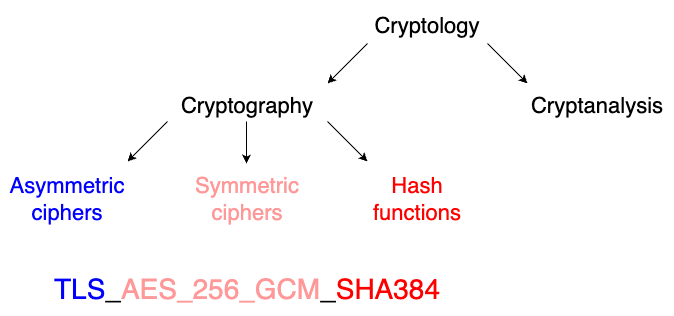
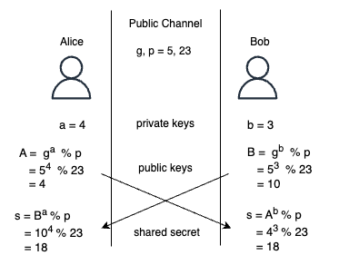

[Table of Contents](../../README.md) | [&larr; API Concepts](../API-CONCEPTS.md) | [Web Protocols &rarr;](../http/README.md)

## Network

The following is the supplementary content to the Network chapter, which introduces TCP (Transmission Control Protocol) and TLS (Transport Layer Security) protocols.

### Requirements

* [Docker Engine](https://docs.docker.com/engine/install/) or [Docker Desktop](https://docs.docker.com/desktop/)
* [Docker Compose](https://docs.docker.com/compose/install/)
* Optionally [Wireshark](https://www.wireshark.org/)
* Optionally [screen](https://www.gnu.org/software/screen/) on Linux or MacOS

### Network Lab Setup

The setup steps in this section are to be executed once, starting from the root of the book's code repository.

The first script creates three Docker containers: `client`, `router`, and `server`.
The second script creates a network routing between the client and the server through the router.

```bash
cd src/network
bash scripts/setup_containers.sh
bash scripts/setup_network.sh
```

<details>
<summary>Show the above example as an animated GIF</summary>

[](https://youtu.be/R4IxmkFLJ8U)

</details>

### Implementing TCP ECHO Service

This section is a condensed version of one of the demonstrations of TCP features discussed in the book.

> [!NOTE]
> The TCP ECHO service consists of a server that waits for an incoming connection from a client, reads data from the connection, and writes the data back over the connection until the client terminates it.

#### TCP ECHO Service

The goal of this section is to demonstrate the functionality of a TCP ECHO service.

```bash
# In a terminal run <1>
tmux new-session \; split-window -v \; split-window -v \;

# In the top pane run <2>
docker compose exec server bash -c "sudo python src/tcp_echo/server.py"

# In the middle pane run <3>
CLIENT=netcat
PCAP_FILE=/tmp/tcp_echo_client_${CLIENT}.pcap
docker compose exec client bash -c \
       "sudo rm --force ${PCAP_FILE} && \
       sudo tcpdump -c 12 -w ${PCAP_FILE} 'not icmp and not icmp6' && \
       cp ${PCAP_FILE} tests"

# In the bottom pane run <4>
docker compose exec client bash -c "sudo ip neigh flush all"
docker compose exec client bash -c \
       "(echo -n Hello | netcat -p 8080 -i 1 -q 1 server 8080) && echo"
```

1. Create three panes with tmux.

2. Start the TCP Echo server.

3. Start `tcpdump` to capture packets.
For now, `tcpdump` will be waiting, but after the TCP ECHO service message exchange is complete, the `tcpdump` program will exit, capturing the expected number of 12 packets.
It will save the _tcp_echo_client_netcat.pcap_ file into the _tests_ directory.
The test directory also contains reference pcap files available as _*_reference.pcap*_.

4. Before invoking the client, in the third pane window, clear the ARP (Address Resolution Protocol) cache on the client.
The ARP cache stores IP address to Media Access Control (MAC) address mappings, and it needs to be cleared here, so it can be demonstrated that the client performs an ARP request, instead of using the cache.
Then invoke the TCP ECHO client using `netcat`.
The client is expected to print "Hello" message received back from the server and then exit.

<details>
<summary>Show the above example as an animated GIF</summary>

[](https://youtu.be/EldsV3fF3vE)

</details>

After both the client and `tcpdump` exited, you can stop the server by pressing `Ctrl+C`.
List the frames captured by `tcpdump`.

```bash
CLIENT=netcat
docker compose exec client bash -c "tshark --read-file tests/tcp_echo_client_${CLIENT}.pcap"
```

The output will look similar to the one below.

```
clientMAC → Broadcast ARP Who has router? Tell client                    # <1>
routerMAC → clientMAC ARP router is at routerMAC                         # <2>
client → server       TCP [SYN]      Seq=0=c0                      Len=0 # <3>
server → client       TCP [SYN, ACK] Seq=0=s0       Ack=1=c0+1     Len=0 # <4>
client → server       TCP [ACK]      Seq=1=c0+1     Ack=1=s0+1     Len=0 # <5>
client → server       TCP [PSH, ACK] Seq=1=c0+1     Ack=1=s0+1     Len=5 # <6>
server → client       TCP [ACK]      Seq=1=s0+1     Ack=6=c0+1+5   Len=0 # <7>
server → client       TCP [PSH, ACK] Seq=1=s0+1     Ack=6=c0+1+5   Len=5 # <8>
client → server       TCP [ACK]      Seq=6=c0+1+5   Ack=6=s0+1+5   Len=0 # <9>
client → server       TCP [FIN, ACK] Seq=6=c0+1+5   Ack=6=s0+1+5   Len=0 # <10>
server → client       TCP [FIN, ACK] Seq=6=s0+1+5   Ack=7=c0+1+5+1 Len=0 # <11>
client → server       TCP [ACK]      Seq=7=c0+1+5+1 Ack=7=s0+1+5+1 Len=0 # <12>
```

1. The client consults the routing table to obtain the router's IP address.
It then broadcasts an Ethernet ARP (Address Resolution Protocol) request to discover the router's Media Access Control (MAC) address (routerMAC).
The purpose of ARP is to provide a mapping from the IP address to the MAC address on the local network.

2. The routerMAC responds to the client over Ethernet, confirming that the router's IP address corresponds to the routerMAC MAC address.

3. The TCP three-way handshake starts.
The client initiates a TCP connection by sending a segment with zero payload size (Len=0), and the SYN flag set, marking the segment with its own sequence number (Seq=0).
Both the client's initial sequence number (c0), and the server's initial sequence number (s0) are generated according to an algorithm, and are usually non-zero.
However, for the purpose of human readability, each of them is taken by `tshark` as the relative zero reference (Seq=0) for the client and server.

4. The server responds to the client with a segment of zero payload size, setting its own sequence number (Seq=s0), and acknowledging receipt of the client's [_phantom byte_](https://support.novell.com/techcenter/articles/nc2001_05e.html) (also called _ghost byte_) by adding 1-byte to the client's sequence number (Ack=c0+1).
As mentioned above, `tshark` will present this as Ack=1 (instead of Ack=c0+1, which may be a large number).
This acknowledgment may seem unexpected, as the payload length is zero, but one byte is acknowledged.
This is because segments with SYN or FIN flags set are counted as having an additional 1-byte length, known as a _phantom byte_.
The sent segment has both SYN and ACK flags set.

5. The client advances its sequence number by 1-byte (Seq=c0+1) due to having sent a _phantom byte_, and acknowledges receipt of the server's _phantom byte_ by adding 1-byte to the server's initial sequence number (Ack=s0+1).
The client sends this segment with the ACK flag set.
At this point, the TCP three-way handshake is complete, and the client is ready to send messages.

6. The client sends a 5-byte message "Hello" (Len=5) to the server.
The PSH flag is set, indicating that the TCP stack on the server should immediately deliver the segment to the application without buffering.

7. The server acknowledges receipt of the 5-byte segment from the client (Ack=c0+1+5).

8. The server echoes to the client the same 5-byte "Hello" message of Len=5.

9. The client advances its sequence number by the length (5) of the "Hello" message it sent, to (Seq=c0+1+5), and sends an ACK segment.

10. The client sends a FIN segment to indicate its desire to terminate the connection.
This is when the client has no more messages to send.

11. The server advances its sequence number by the length of the "Hello" message it echoed to the client, acknowledges receipt of 7-bytes (Ack=c0+1+5+1) from the client thus far (including two _phantom bytes_), and confirms the end of the connection by setting the FIN flag.

12. The client advances its acknowledgment number by the _phantom byte_ received from the server, and confirms the termination of the connection with the ACK flag.

<details>
<summary><strong>TCP ECHO Client with Scapy</strong></summary>

```bash
# In a terminal run
tmux new-session \; split-window -v \; split-window -v \;

# In the top pane run
docker compose exec server bash -c "sudo python src/tcp_echo/server.py"

# In the middle pane run
CLIENT=scapy
PCAP_FILE=/tmp/tcp_echo_client_${CLIENT}.pcap
docker compose exec client bash -c \
       "sudo rm --force ${PCAP_FILE} && \
       sudo tcpdump -c 12 -w ${PCAP_FILE} 'not icmp and not icmp6' && \
       cp ${PCAP_FILE} tests"

# In the bottom pane run
docker compose exec client bash -c "sudo ip neigh flush all"
docker compose exec client bash -c \
        "sudo python src/tcp_echo/client_scapy.py && echo"
```

[](https://youtu.be/RLrnEGHJ9MY)

</details>

### Security

Encryption is a common way to enhance the security of network communication today.
However, standardized encryption wasn't feasible at the time, due to the so-called [Crypto Wars](https://en.wikipedia.org/wiki/Crypto_Wars) (not to be confused with the more recent cryptocurrency wars), where the United States and its allies limited the public's and other nations' access to cryptography.
Restrictions on foreign access to encryption technology were lifted in the 1990s, leading to the development of web encryption protocols((("web encryption protocols"))) such as SSL/TLS (Secure Sockets Layer/Transport Layer Security).

#### Introduction to cryptography

Cryptology is the field of science that explores methods of secure communications.
It comprises cryptography, which deals with securing the communication, and cryptanalysis, which attempts to break the security.[^1]

As you can see in the image below, TLS uses three domains of cryptography: _asymmetric ciphers_, _symmetric ciphers_, and _hash functions_.
Using the methods, called cryptographic primitives, established in these domains, cryptography aims to achieve its security goals, including confidentiality, integrity, authenticity, and non-repudiation.[^2]
These goals are introduced and explained in the following section, in the context of the TLS version 1.3 cipher suite `TLS_AES_256_GCM_SHA384`.

<div align="center">
  
</div>

A cipher is a method to secure the communication.
The message to be secured is called plaintext, and the message after being transformed into a secure format is called ciphertext.
Transforming the plaintext into ciphertext is called encryption, and the inverse process of transforming ciphertext into plaintext is called decryption.
Both encryption and decryption require a key.
When the encryption and decryption use different keys, the cipher is asymmetric, and when the same key is used for encryption and decryption, the cipher is symmetric.

The earliest attempts to secure communications used symmetric ciphers.
An example of it, is `Caesar Cipher`, demonstrated below using Python's Read, Evaluate, Print, Loop (REPL) in.
Encryption shifts the letters of the alphabet up by three positions.
The number 3 can be considered the key.
For example, "abc" becomes "def".
The plaintext "Hello", encrypted with this cipher, becomes the "Khoor" ciphertext.
Decryption consists of shifting the letters down by three positions.

> [!NOTE]
> Encryption provides `confidentiality`.
> Confidentiality ensures that information is accessible only to the authorized party who has the decryption key.

```python
>>> "".join([chr(ord(c) + 3) for c in "Hello"])
"Khoor"

>>> "".join([chr(ord(c) - 3) for c in "Khoor"])
"Hello"
```

> [!TIP]
> You can start Python's REPL with `docker compose exec client python`, and stop by typing `exit()` followed by _ENTER_.

While the word "Khoor" appears not related to the original "Hello" message, an attacker can try all values of the shifts until a plausibly sounding message emerges, recovering the shift value.
Such type of attack is called a brute-force attack--to try all possible keys to recover the plaintext from the ciphertext.

Another type of attack is based on the frequency analysis of the letters in the given language.
For example, in English, the letter `e` is the most commonly used one, with a frequency of about 13%.
An attacker who is in possession of a longer ciphertext, can map the most frequent letter in the ciphertext to `e`, and proceed analogously to guess other letters.
This attack may also work against a cipher that uses an arbitrary mapping of letters, and not only against a cipher that shifts the letters.

Taking the frequency analysis and other types of attacks (e.g., side-channel attacks) into account, the question arises whether it is possible to guarantee the confidentiality of communication at all.
One way to achieve this guarantee would be to make sure that the cipher algorithm is never known publicly.
However, the incentives to discover or leak the algorithm would probably eventually lead to its exposure.
Therefore we are left with the other component of the cipher--the key, as the provider of confidentiality.
This is the idea behind the Kerckhoffs' principle, which states that cipher should be secure, even if everything about it, except the key, is publicly known.

The question still remains: how can confidentiality be achieved based solely on the key, while the cipher algorithm is public?
The closest approach to achieving this is the construction of a one-time pad (OTP), built as follows.
Instead of using letters of the alphabet, the plaintext is represented as a binary number.
There exists a mathematical operation called XOR (exclusive OR), with the following truth table as shown below, which produces a 0 or 1 bit with equal probability (50%).
If the plaintext is XORed with a truly random[^3] key, and the key is never reused, the attacker has no better chance than 50% of guessing each bit of the plaintext.

<div align="center">

| A   | B   | A XOR B |
| --- | --- | ------- |
| 0   | 0   |    0    |
| 0   | 1   |    1    |
| 1   | 0   |    1    |
| 1   | 1   |    0    |

</div>

The XOR operation has another useful property: applying XOR twice results in an identity operation.
This means that encryption involves performing a bitwise XOR between the plaintext and key bits, and decryption requires applying the XOR operation once more.
The following demonstrates such use of XOR.

```python
>>> import random
>>> random.seed(42)  # <1>
>>> plaintext = format(ord("H"), "07b")  # <2>
>>> plaintext
"1001000"

>>> key = format(random.randint(0, 127), "07b")  # <3>
>>> key
"0011100"

>>> ciphertext = "".join([str(int(c) ^ int(k)) for c, k in zip(plaintext, key)]) # <4>
>>> ciphertext
"1010100"

>>> "".join([str(int(c) ^ int(k)) for c, k in zip(ciphertext, key)])  # <5>
"1001000"
```

1. This line sets the seed of the pseudo-random number generator, to achieve a deterministic behavior across multiple runs.
This ensures that you get the same result as shown here.
Note that using a pseudo-random number, as opposed to a truly random number is a violation of the OTP principle.
By definition, if the number is an outcome of an algorithm, it isn't truly random.
However, using pseudo-random numbers is acceptable for most applications.

2. The `format` function converts the uppercase 7-bit ASCII letter "H" to a string of 7 bits.

3. The `randint` function generates a string of random 7 bits to be used as the symmetric key.

4. This list comprehension performs a bit-wise XOR operation (^) between the plaintext and key, resulting in encryption of the plaintext to ciphertext.

5. The output of this list comprehension confirms that the decryption by bit-wise XOR'ing the ciphertext with the key returns the original plaintext.

> [!WARNING]
> The Python's `random` module shouldn't be used for cryptographic purposes.
> Instead, a dedicated module for generating cryptographically secure pseudo-random numbers, like the `secrets` module, should be used.

OTP is an example of a stream cipher, which encrypts the plaintext bit-by-bit.
From the strict requirements for OPT, it follows that it's a secure, but unwieldy construction, as the key needs to be as long as the plaintext, truly random, and securely shared with all receivers of the ciphertext.
Imagine that before watching a 1 gigabyte video online, you would need to generate a 1 gigabyte key using a physical process considered random, like radioactive decay.
Then share this key with the online service using a secure channel, for example by physically traveling, and handing the key to the service representative.

For this reason, instead of OTP, dedicated symmetric ciphers are used, with [Advanced Encryption Standard](https://doi.org/10.6028%2FNIST.FIPS.197) (AES)[^4] being the most popular one.
Its construction allows the use of the same key to encrypt multiple blocks of plaintext.
This is achieved by introducing an additional element of randomness called a nonce (number used only once), to ensure that the same two plaintext blocks encrypt to different ciphertexts, similar to OTP.
Additionally, a special mode of operation of AES, called Gallois counter mode (GCM)[^5], allows the receiver of the ciphertext, who is in possession of the key, to verify integrity and authenticity of the received message.

> [!NOTE]
> `Integrity` guarantees that the correctness and completeness of the information can be verified, and `authenticity` allows the receiving party to verify that the information comes from the given sender.

At this point, you may be ready to grasp the purpose of the cipher suite component `AES_256_GCM`, present the TLS version 1.3 cipher suite `TLS_AES_256_GCM_SHA384`.
It provides confidentiality, integrity and authenticity to the application data exchanged over TLS, by means of symmetric encryption.
The role of this cipher component will be further explained in [TCP ECHO Client with OpenSSL](#tcp-echo-client-with-openssl) section, using an actual packet capture.

Unfortunately, symmetric ciphers have shortcomings.
The main issue with symmetric ciphers is that they require the key to be shared among all parties involved in the communication.
This necessitates a secure method for key distribution, which itself requires confidentiality, creating a circular problem.
Therefore, symmetric ciphers require a separate secure channel for key distribution.
The number of these channels may become large, since the number of key distributions grows quadratically with the number of communicating parties.
For example, for `n` employees in a company, the number of `n * (n - 1) / 2` channels would need to be established, with each employee managing `n - 1` keys.
For a company with 1000 employees, this amounts to almost 0.5 million key exchanges.
Additionally, symmetric ciphers cannot provide non-repudiation.

> [!NOTE]
> `Non-repudiation` guarantees that information can be attributed to the source of it, by any party participating in communication.
> From the definitions, it follows that if a cryptographic method provides non-repudiation, then it provides authentication as well.
>
> Symmetric ciphers cannot provide non-repudiation, since they rely on a shared key, making it impossible to uniquely attribute a ciphertext to a single party.

The good news is that asymmetric ciphers solve these problems.
They establish a secure key distribution channel, and provide non-repudiation.
Let's discuss how asymmetric ciphers achieve this.

In asymmetric cryptography, also known as public-key cryptography, each party has a pair of keys: a public key, which can be shared openly, and a private key, which isn't shared with anyone.
A real-world analogy of a bank account conveys some aspects of this idea.
Your account number is the public key.
Anyone who knows this number can use it to send money to it.
However, only you, the owner of the account, can withdraw money using your private credentials (like a PIN or password), which are analogous to the private key.

On the other hand, symmetric cryptography is like a safe.
Only people who know the combination (key) to the safe can open it.
This is similar to how the same key is used for both encryption and decryption in symmetric cryptography.
DH is a common public-key cryptography protocol used to establish a shared secret over an insecure communication channel.
DH is named after the surnames of Whitfield Diffie and Martin Hellman, who published it in 1976.[^6]
DH is used as the acronym when referred to this key establishment method.
A numerical example that helps to understand the mathematics of DH key establishment is provided visually on the diagram, and as a Python interactive session below.[^7]
This demonstration of the protocol uses a common setup used to discuss asymmetric cryptography, involving two communicating parties, Alice and Bob.[^8]

<div align="center">
  
</div>

```python
>>> g, p = 5, 23      # <1>

>>> a = 4             # <2>
>>> A = (g ** a) % p  # <3>
>>> A
4

>>> b = 3             # <4>
>>> B = (g ** b) % p  # <5>
>>> B
10

>>> s = (B ** a) % p  # <6>
>>> s
18

>>> s = (A ** b) % p  # <7>
>>> s
18
```

1. The protocol requires a large prime number `p`, and a corresponding number `g`, the generator of the multiplicative group of integers modulo `p`.
Both these numbers are publicly known. This demonstration uses a small prime number `p` for readability.[^9]

2. One party of the communication, called Alice, generates a random integer number `a`, this is Alice's private key.

3. Alice calculates her public key `A` from the private key, by raising the generator `g` to the power of her private key `a`, calculated modulo `p`.
The private and public key being equal to 4 in this demonstration is a coincidence.
Alice sends her public key over a public communication channel to another side of the communication, Bob.

4. Bob performs analogous operations, to create his private and public key. First, he randomly generates his private key `b`.

5. Then Bob calculates his public key `B`, and sends it to Alice.

6. Alice calculates the shared secret `s` by raising the Bob's public key `B` to the power of her private key `a`, modulo `p`.

7. Bob calculates the shared secret `s` analogously, using Alice's public key and his private key.
The mathematics of DH key establishment asserts that Alice and Bob possess the same value of the shared secret, without ever exchanging it over the communication channel.
The reader can verify numerically that `(B ** a) % p == (((g ** b) % p) ** a) % p == ((g ** b) ** a) % p == (g ** (b*a)) % p == (g ** (a*b)) % p == ((g ** a) ** b) % p == (((g ** a) % p) ** b) % p == (A ** b) % p`.

You may ask a question about what prevents an attacker from calculating Alice's private key `a`, based on the publicly known public key `A`, prime number `p`, and generator `g`.
The answer lies in the mathematical operation of logarithm, which is the inverse to exponentiation.
The security of DH depends on the computational difficulty of calculating the discrete logarithm of a large integer number[^10] compared to less computationally demanding discrete exponentiation.

DH provides a solution to the symmetric ciphers' need to establish a key distribution channel.
The actual symmetric key isn't being exchanged, only the public keys are exchanged.
Each communicating party using its own private key, together with the peer's public key, to calculate a shared secret.
This is why DH is usually called a key establishment rather than a key exchange.

However, DH doesn't provide non-repudiation, since the private keys are only used for establishing the shared secret, and aren't used to identify the communicating parties.
Moreover, DH is used to produce ephemeral keys (referred to as DHE for Diffie-Hellman Ephemeral), which are discarded after the communication session ends.[^11]
Therefore, these ephemeral keys, cannot be used for long-term non-repudiation purposes.
Instead, non-repudiation can be provided using a construct of asymmetric cryptography called digital signatures.

It should be noted, that since TLS uses symmetric encryption for application data, TLS doesn't provide non-repudiation.
Nevertheless, TLS makes use of digital signatures, as part of X.509 certificates, used for authentication of the parties.
Digital signatures, in turn, make use of hashing, so let's describe hashing first, and come back to certificates later.

A hash function[^12] is the main tool to provide cryptographic integrity. Such a function performs a mapping from an arbitrary-size input into a fixed-size output.
Nowadays (2025), the output size ranges from 224 to 512 bits for the `SHA` (Secure Hash Algorithm) family of functions.
The hash functions are designed to be one-way, meaning there is no known method of calculating input from the given output, except for brute-force trying all possible inputs.
The result of the hash function is deterministic--given input always produces the same output.
On the other hand, a small change in the input changes many bits of the output, known as the avalanche effect.
For example, in the following code, you can see that a change of one character in the input leaves only a single hex digit unchanged in the output.

```bash
echo -n "Hello" | sha256sum
185f8db32271fe25f561a6fc938b2e264306ec304eda518007d1764826381969

echo -n "Hallo" | sha256sum
753692ec36adb4c794c973945eb2a99c1649703ea6f76bf259abb4fb838e013e
```

If the input is larger than the output, it is intuitive that multiple inputs need to map to a single output.
This observation is called a _pigeonhole principle_, and states that when there are more pigeons than containers, at least one container needs to contain more than one pigeon.
The situation where there are more containers than pigeons, but still there is more than one pigeon in at least one container, is called _birthday problem/paradox_.
The birthday problem is a nonintuitive result from probability theory.
For example, only 23 random people (or pigeons) are needed for the probability of them being born on the same day of the year to exceed 50%.

Hash outputs are often used to compare digital content, instead of comparing the full input content.
Having two inputs to hash to the same output is called a _hash collision_, and it's undesirable from the security point of view.[^13]

A hash function is also a component of the HMAC-based (Hash-based message authentication code) Extract-and-Expand Key Derivation Function (HKDF),[^14] whose purpose is to derive cryptographically strong, pseudorandom keys from an existing, not necessarily cryptographically strong, input key.
The familiarity with HKDF allows us to outline the role of the `SHA384` hashing function, present in the `TLS_AES_256_GCM_SHA384` cipher suite.
In TLS version 1.3, the shared secret provided by the key establishment protocol isn't used directly as the symmetric key in AES.
Instead several layers of keys: shared secret -> early secret -> handshake secret -> master secret -> application secret, are derived with HKDF, which uses the hashing function specified in the TLS cipher suite.
The final application secrets (one for the server and one for the client) are used as key inputs for the AES symmetric cipher.

`TLS` is the remaining component to explain in the TLS version 1.3 cipher suite.
In the previous TLS versions, this component explicitly listed the pair of algorithms, such as `TLS_ECDHE_ECDSA` or `TLS_ECDHE_RSA`, used for key establishment and authentication.
In TLS version 1.3, the cipher suite doesn't explicitly contain this information.
The key establishment methods are limited to Diffie-Hellman Ephemeral (DHE) or Elliptic Curve Diffie-Hellman Ephemeral (ECDHE).[^15]
The key establishment method is negotiated during the TLS session establishment, together with the digital signature algorithm used by certificates for the authentication of parties.
Therefore this information doesn't appear in the TLS version 1.3 cipher suite.

> [!WARNING]
> Any public key algorithm is susceptible to the Man-in-the-Middle (MITM) attack, if the public key can be captured by the attacker and replaced by attacker's key.
> The attacker can then act as a proxy between the communicating parties without the parties being aware of the attack.

The X.509 standard attempts to reduce the likelihood of MITM attacks by introducing certificates.
An X.509 certificate binds the public key to an additional identity information, such as a server name, and signs this information using a digital signature algorithm.

Since certificates make use of digital signature algorithms, which are based on public key cryptography, certificates themselves are susceptible to MITM attacks.
As a consequence, X.509 certificates (also called SSL or TLS certificates) don't rely exclusively on technology to prevent MITM attacks, but also require an external source of trust.
Certificate authorities (CAs), which are real-world institutions operated by people, are used as trust anchors.
This trust is developed and maintained using certificates.
However, the initial trust in the CA is established through a separate communication channel, such as the distribution of trusted certificates by operating system vendors.

The workings of certificates and signing are easier to demonstrate in practice than to explain, and this is the subject of the next section.

#### X.509 Public Key Infrastructure Certificates

The authentication of parties communicating using certificate-based TLS relies on CAs as the trust anchors.
The trust in CAs is assumed, and not derived.

First, a CA generates its private key.
The certificate is the corresponding public key supplemented by the identity information about the CA, such as its name in the `Subject` field in the certificate.
CA then uses its private key to sign the hashed content of the certificate.
By definition, the top-level (root) CA certificate is self-signed, meaning the `Subject` and `Issuer` fields of the certificate are the same.

The following code shows the creation of a self-signed root CA certificate for a fictitious `example.com` root CA uses [openssl](https://www.openssl.org) command line tool to create the private key (`ca.key`) and self-signed certificate (`ca.crt`), and sets `example.com Root CA` as the `Subject` name of the certificate.

The CA also selects a public-key cryptography algorithm and the key length, in this example `rsa:3072`, and issues the certificate to be valid for `3650` days.[^16]
The certificate extensions must be chosen to represent the role of this certificate.
In this case, since the `Subject` is CA, it is marked as such using `CA:TRUE`.
The `cRLSign` and `keyCertSign` key usage values allow the `Subject` public key to be used for verifying certificate revocation lists,[^17] and signatures on certificates, respectively, both issued by the `Subject`.

```bash
docker compose exec server bash -c \
       'openssl req -x509 -newkey rsa:3072 -days 3650 -nodes \
       -keyout ca.key -out ca.crt -subj "/CN=example.com Root CA" \
       -addext "basicConstraints=critical,CA:TRUE" \
       -addext "keyUsage=cRLSign,keyCertSign"'
```

Until now, we have a root CA certificate, but we are interested in obtaining a certificate for our server.
The root CA could issue such certificate, by receiving the public key of the server from us, binding it with the server name into a certificate, and signing using the generated root CA private key (`ca.key`).
Nevertheless, this isn't done in practice.

Any use of the private key creates a risk of leaking it.
Therefore, the root CA minimizes the use of the private key, by storing it in a Hardware Security Module (HSM), in a safe, and employing additional physical security measures.
Instead of directly issuing server certificates, the root CA will issue certificates for so-called issuing CAs, and only these issuing CAs will issue certificates for consumer servers.
This will create a certificate chain of trust with the root CA as the trust anchor.

The following code shows issuing CA certificate signing request, the issuing CA, e.g., `example.com Issuing CA`, a separate organization from the root CA, will generate its private key (`ica.key`).
The issuing CA coverts its public key into a certificate signing request (`ica.csr`), and sends it to the root CA, who signs it with its private key.
Note that the public-key cryptography algorithm can differ among various certificates present in the certificate chain.
In our example, the issuing CA uses Elliptic Curve Cryptography (ECC), while the root CA uses RSA.

```bash
docker compose exec server bash -c \
       'openssl req -new -newkey ec:<(openssl ecparam -name prime256v1) -nodes \
       -keyout ica.key -out ica.csr -subj "/CN=example.com Issuing CA"'
```

The next code shows signing of issued CA certificate signing request, the root CA signs the issuing CA certificate signing request.
The CA decides about the validity period of the certificate, and since the issuing CA is still a CA, the root CA sets the `CA:TRUE` and required key usage capabilities.
The root CA sends the signed certificate (`ica.crt`) to the issuing CA.

```bash
docker compose exec server bash -c \
       'openssl x509 -req -CAcreateserial -days 365 \
       -in ica.csr -out ica.crt -CA ca.crt -CAkey ca.key \
       -extfile <(printf "basicConstraints=critical,CA:TRUE\n\
       keyUsage=keyCertSign,cRLSign")'
```

At this point, as shown in the next code, the administrator of the server chooses an issuing CA, generates a certificate signing request (`server.csr`) for its server, and sends it to the issuing CA for signing.

```bash
docker compose exec server bash -c \
       'openssl req -new -newkey ec:<(openssl ecparam -name prime256v1) -nodes \
       -keyout server.key -out server.csr -subj "/CN=server" \
       -addext "subjectAltName=DNS:server"'
```

The following  shows the issuing CA uses its (`ica.key`) private key to sign the server certificate signing request.
The subject of this certificate, the server, isn't a CA.
Therefore, the issuing CA sets `CA:FALSE` on the certificate, and also sets the `digitalSignature` key usage required for the certificate to be used for `serverAuth` (server authentication) using TLS version 1.3.
The issuing CA sends the signed certificate (`server.crt`) to the server administrator.

```bash
docker compose exec server bash -c \
       'openssl x509 -req -CAcreateserial -days 365 -copy_extensions copy \
       -in server.csr -out server.crt -CA ica.crt -CAkey ica.key \
       -extfile <(printf "basicConstraints=critical,CA:FALSE\n\
       keyUsage=digitalSignature\nextendedKeyUsage=serverAuth")'
```

The administrator of the server now has its private key (`server.key`), and three certificates that compose the chain.
Most server software requires the certificates to be concatenated into a single file.
TLS version 1.2 and earlier, required the server certificate to be present first in the file, followed by issuing CA certificates in their order towards the root CA, with the self-signed root CA included last, but usually omitted.[^18]
TLS version 1.3 relaxed this order requirement, and only requires for the server certificate to be present as the first one.

Before creating the certificate chain in create server certificate chain, the administrator, in verify issuing CA certificate, verifies the signature of the root CA on the issuing CA certificate.
The `(untrusted)` label in the output indicates that the issuing CA certificate isn't present in the trust store[^19] of the machine that executes this command.

```bash
docker compose exec server bash -c \
       'openssl verify -show_chain -CAfile ca.crt ica.crt'

ica.crt: OK
Chain:
depth=0: CN = example.com Issuing CA (untrusted)
depth=1: CN = example.com Root CA
```

After assuming trust in the root CA, and developing trust in the issuing CA certificate, the administrator, the following code verifies the signature of the issuing CA on the server certificate.

```bash
docker compose exec server bash -c \
       'openssl verify -show_chain -trusted ca.crt -trusted ica.crt server.crt'

server.crt: OK
Chain:
depth=0: CN = server (untrusted)
depth=1: CN = example.com Issuing CA
depth=2: CN = example.com Root CA
```

```bash
docker compose exec server bash -c \
      'cat server.crt ica.crt > server_chain.crt'
```

After verifying the certificate chain, the server private key (`server.key`) and the server certificate chain (`server_chain.crt`) can be deployed onto the server software.[^20]
The root CA certificate (`ca.crt`) needs to be distributed to the trust store on the clients that connect to the server.

Before demonstrating the use of the server certificate, let's look at its contents.
The following example explains the main fields.
The ability to understand the overall certificate contents is important for maintaining security on the web.

```
docker compose exec server bash -c 'openssl x509 -in server.crt -noout -text'

Certificate:
    Data:
        Version: 3 (0x2)                         # <1>
        Serial Number: 68:..:3c                  # <2>
        Issuer: CN = example.com Issuing CA      # <3>
        Validity                                 # <4>
            Not Before: Sep 15 23:12:05 2024 GMT
            Not After : Sep 15 23:12:05 2025 GMT
        Subject: CN = server                     # <5>
        Subject Public Key Info:                 # <6>
            Public Key Algorithm: id-ecPublicKey
                Public-Key: (256 bit)
                pub: 04:...:e2
                ASN1 OID: prime256v1
                NIST CURVE: P-256
        X509v3 extensions:                       # <7>
            X509v3 Basic Constraints: critical
                CA:FALSE
            X509v3 Key Usage:
                Digital Signature
            X509v3 Extended Key Usage:
                TLS Web Server Authentication
    Signature Algorithm: ecdsa-with-SHA256       # <8>
    Signature Value: 30:...:33                   # <9>
```

1. This certificate uses the X.509 latest v3 format, described in [RFC 5280](https://datatracker.ietf.org/doc/html/rfc5280).

2. The serial number of the certificate must be unique within the given `Issuer`, in this case the issuing CA.

3. The `example.com Issuing CA` has signed and issued this certificate.

4. The certificate has a validity period, during which the CA guarantees to maintain the information about the status of the certificate, such as whether it has been revoked.

5. The certificate is issued for the `Common Name` server.
Normally, this would be a domain on which the web server is accessible, such as `www.example.com`.

6. The server public key is of ECC type and uses the `P-256` (also known as `prime256v1`) elliptic curve.
The `pub` field contains the server public key in a format of colon-separated hex bytes.

7. The `X509v3` extensions confirm that the certificate is a server certificate. With `CA:FALSE`, the subject (server) private key isn't given CA capabilities to issue and sign further certificates.
The certificate usage is limited to performing TLS authentication of the server with help of digital signatures.
In TLS version 1.3 the certificate is used only for authentication of the parties during the TLS handshake, and therefore, no other key usage capabilities are needed.

8. The `Signature Algorithm` refers to the algorithms used by the `Issuer` to sign this certificate.

9. The `Signature Value` is the ECDSA (Elliptic Curve Digital Signature Algorithm) signature of the server certificate, hashed using `SHA256` and signed using the issuing CA private key.

#### TCP ECHO Client with OpenSSL

Having in place the X.509 certificate chain required to authenticate the server, the TCP ECHO service can be secured with TLS.
Most operating systems don't implement TLS in the kernel space by default.
Instead, the implementation is provided by third-party libraries in the user space.
It is feasible to implement the TCP ECHO client over TLS using Python's [ssl](https://docs.python.org/3/library/ssl.html) standard library API.
However, in this section, to reduce the amount of code written, you'll use `openssl` command line tool as the ECHO service client to generate TCP traffic secured with TLS.
The resulting packet capture is explained in [TCP ECHO Client with OpenSSL](#tcp-echo-client-with-openssl) to highlight the protocol level features of TLS.
To follow along, execute the steps below.

```bash
# In a terminal run <1>
tmux new-session \; split-window -v \; split-window -v \;

# In the top pane run <2>
docker compose exec server bash -c "sudo python src/tcp_echo/server.py"

# In the middle pane run <3>
CLIENT=openssl
PCAP_FILE=/tmp/tcp_echo_client_${CLIENT}.pcap
docker compose exec client bash -c \
       "sudo rm --force ${PCAP_FILE} && \
       sudo tcpdump -c 18 -w ${PCAP_FILE} 'port 443' && \
       cp ${PCAP_FILE} tests"

# In the bottom pane run <4>
docker compose exec client bash -c \
       'export SSLKEYLOGFILE=tests/SSLKEYLOGFILE.client && \
       (echo -n Hello && sleep 1 && echo -n) | \
       openssl s_client -brief -connect server:443 \
       -CAfile ca.crt -verify_return_error \
       -keylogfile ${SSLKEYLOGFILE} -servername server -tls1_3'
```

1. Create three panes with tmux.

2. Start the server.
The difference here is, that in addition to the server, the `stunnel` program (not shown explicitly here) was started in the background.
It is listening on port 443, and acting as a TLS wrapper over the TCP ECHO server.[^21]

3. Start `tcpdump`, this time capturing traffic on TLS port 443.
The ARP traffic is excluded from the capture for simplicity.

4. Invoke the `openssl` client.
As with all demonstrations in this chapter, the client prints "Hello" received back from the server and exits.
The presence of the (`ca.crt`) root CA certificate among the command line options is worth noticing.
This emphasizes that the decision to trust the given CA is made on the client side.
Operating systems or larger programs like web browsers come with their own trust store, which contains the certificates of the CAs they have decided to trust.
However, a client can choose to place any certificate in the trust store, or trust a CA in a one-off manner, as in this case.
Another element worth mentioning is the _SSLKEYLOGFILE_ file (called `SSLKEYLOGFILE.client` in this case).
Many programs that implement TLS, like `openssl` or web browsers, support the creation of a _SSLKEYLOGFILE_ file, which stores various types of secrets needed to decrypt the data exchanged during the TLS session.
Avoid creating this file, or keep is private when working on real systems!

<details>
<summary>Show the above example as an animated GIF</summary>

[](https://youtu.be/z9O_VNEPiD8)

</details>

Below is the generated packet capture, which is then decrypted using the secrets read from _SSLKEYLOGFILE_, and stored in a _pcapng_ (PCAP Next Generation Dump File Format) file.

```bash
CLIENT=openssl
docker compose exec client bash -c \
       "cd tests && \
       editcap --inject-secrets tls,SSLKEYLOGFILE.client \
       tcp_echo_client_${CLIENT}.pcap tcp_echo_client_${CLIENT}.pcapng"
```

The decrypted packet sequence, when read with `tshark --read-file tests/tcp_echo_client_openssl.pcapng`, will look as the one listed below.

The following discussion is long, but it still covers only the main features of TLS.
For example, the pre-shared key, session tickets, and some types of derived secrets aren't mentioned.[^22]
You are invited to compare our sequence with a more complete, reference example of a TLS version 1.3 session at [https://tls13.xargs.org](https://tls13.xargs.org).

```
client → server TCP     [SYN]      Seq=0              Len=0                    # <1>
server → client TCP     [SYN, ACK] Seq=0     Ack=1    Len=0                    # <1>
client → server TCP     [ACK]      Seq=1     Ack=1    Len=0                    # <1>
client → server TLSv1.3 Client Hello (SNI=server)                              # <2>
server → client TCP     [ACK]      Seq=1     Ack=254  Len=0                    # <3>
server → client TLSv1.3 Server Hello, Change Cipher Spec,                      # <4>
                        Encrypted Extensions, Certificate, Certificate Verify, # <5>
                        Finished                                               # <6>
client → server TCP     [ACK]      Seq=254   Ack=1569 Len=0
client → server TLSv1.3 Change Cipher Spec, Finished                           # <7>
client → server TLSv1.3                                                        # <8>
server → client TCP     [ACK]      Seq=1569  Ack=361  Len=0
server → client TLSv1.3                                                        # <9>
client → server TCP     [ACK]      Seq=361   Ack=1596 Len=0
client → server TLSv1.3 Alert (Level: Warning, Description: Close Notify)      # <10>
client → server TCP     [FIN, ACK] Seq=385   Ack=1596 Len=0                    # <11>
server → client TLSv1.3 Alert (Level: Warning, Description: Close Notify)      # <10>
client → server TCP     [ACK]      Seq=386   Ack=1620 Len=0
server → client TCP     [FIN, ACK] Seq=1620  Ack=386  Len=0                    # <11>
client → server TCP     [ACK]      Seq=386   Ack=1621 Len=0                    # <11>
```

1. A TCP three-way handshake is established from the client to the server.

2. The client starts the TLS handshake by sending the `Client Hello`.
The `Client Hello` is a type of message defined by the TLS protocol, distinct from the "Hello" message example contained in the TCP segment.
In particular, `Client Hello` contains the list of supported cipher suites, with `TLS_AES_256_GCM_SHA384` often listed first as the client's preference.
   <br>
   <br>
   The `Client Hello` also includes various additional information such as TLS extensions.
   The extensions include the server name as Server Name Indication (SNI), the supported certificate signature algorithms, the version of TLS desired by the client, and the client's public key share to be used for key establishment.
   For example, the client may select the `x25519` elliptic curve for key establishment.
   All this information is sent unencrypted over the network.
   <br>
   <br>
   As an exercise, try to identify this information in the `Client Hello` by opening the packet capture with Wireshark GUI.

3. The server acknowledges reception of the TCP segment containing the TLS Client Hello request from the client.
The overhead of TLS handshake is already noticeable from the few hundred bytes value of the ACK.
The details of the TCP session, including the meaning of sequence and acknowledgment numbers, aren't discussed here.
Instead, for comparison consult the explanation of TCP in [TCP ECHO Service](#tcp-echo-service) section.

4. The server continues the TLS handshake by sending several TLS records inside of a single TCP segment.
Note that `Server Hello` is a type of message defined by the TLS protocol, not a server's "Hello" response contained in the TCP segment.
The `Server Hello` confirms the cipher suite used. Inside the TLS extensions, the server confirms the TLS version used, and sends its public key share calculated using the key establishment algorithm selected by the client.
   <br>
   <br>
   The legacy `Change Cipher Spec` record follows, which is no longer used actively in TLS version 1.3.  
   From this point, the subsequent TLS records until the TLS session termination are encrypted.
   If `SSLKEYLOGFILE` wasn't used to decrypt the traffic, all TLS records would appear as encrypted `Application Data`.
   The encryption until the end of the TLS handshake happens using the handshake secret derived using the handshake secret derived from the shared secret, and the SHA384 hash of the Client Hello and Server Hello, using HMAC (hash-based message authentication code)–based Extract-and-Expand Key Derivation Function (HKDF).[^23]
   However, the client hasn't yet seen the server certificate, and therefore the server hasn't been authenticated yet.

5. The server sends its certificate chain in one or more TLS records, depending on certificates size.
Then, the server follows with a `Certificate Verify` record.
This record contains the digital signature of the hash of the TLS handshake messages, signed using the server private key associated with the server's certificate.
The purpose of this is to prove to the client that the server owns the certificate presented to the client during this TLS session.
This signature ties the server's ephemeral public key generated during this TLS session (and present in `Server Hello`), with the server private key associated with the server's certificate.
The client uses the server's public key from the certificate to verify this signature.

6. The server follows with a `Finished` record, which contains the `SHA384` hash of all the TLS handshake records up to this point (`Client Hello` to server `Certificate Verify`), encrypted using the handshake secret.
The purpose of this hash is to agree on it with the client, to guarantee the handshake integrity.
The server now has all the information needed to derive the final application secrets.

7. The client verifies the signature of the certificate sent by the server, sends a legacy `Change Cipher Spec`, and its own `Finished` record, based on all handshake records (`Client Hello` to server `Finished`).
This finishes the TLS handshake.
Both the client and the server have now derived the client and server application secrets.
The client application secret derived by the client matches the client application secret derived by the server.
Similarly, the server application secret derived by the client matches the server application secret derived by the server.

8. The client sends the "Hello" message to the server, encrypted with `AES_256_GCM` using the client application secret.

9. The server responds with the "Hello" message, encrypted with `AES_256_GCM` using the server application secret.

10. The client, who has no more data to send, indicates to the server the TLS connection termination using a TLS `Alert` record.
The server confirms it with its own TLS `Alert` record.

11. The client initiates TCP connection termination, and the connection is eventually terminated.

To end this introduction, you'll be presented with a summary of the purpose of the various cipher suite components included in the TLS version 1.3 cipher suite `TLS_AES_256_GCM_SHA384`.[^24]
The `TLS` component of `TLS_AES_256_GCM_SHA384` represents the key establishment algorithm, negotiated during the TLS handshake, and chosen among Diffie-Hellman Ephemeral (DHE), Elliptic Curve Diffie-Hellman Ephemeral (ECDHE), or pre-shared key.
The `AES_256_GCM` component provides confidentiality, integrity and authenticity to the application data exchanged over TLS, by means of symmetric encryption.
The final `SHA384` component is the hash function used by HKDF to derive various secrets, based on the shared secret calculated using the key establishment algorithm.
The X.509 certificates are used to authenticate the parties during the TLS version 1.3 handshake.
The public key cryptography algorithms used for certificates are specified by the certificates themselves, and aren't listed as part of the TLS cipher suite.

### Lab Teardown

After the lab from this chapter is no longer needed, the containers can be stopped, and removed.

```bash
bash scripts/teardown_containers.sh
```

### Testing

The full functionality, including the lab setup and teardown, can be tested using the provided script.
It uses [screen](https://www.gnu.org/software/screen/) to execute commands in the background.

```bash
bash tests/tcp_echo.sh netcat
```

[Table of Contents](../../README.md) | [&larr; API Concepts](../API-CONCEPTS.md) | [Web Protocols &rarr;](../http/README.md)

[^1]: For a theoretical, mathematically oriented introduction to cryptography consult the [Understanding Cryptography](https://www.cryptography-textbook.com) book (available for purchase), and the associated set of freely available lectures by Christof Paar. For a programmer's perspective on cryptography, including implementations of the main algorithms, see the freely available set of courses by [Cyrill Gössi](https://www.youtube.com/@cyrillgossi), or the [Practical Cryptography in Python](https://link.springer.com/book/10.1007/978-1-4842-4900-0) book available for purchase.

[^2]: See the [Cryptography with Python 2: Cryptography & its classic security goals](https://youtu.be/47GBTHUnR8k) lecture by Cyrill Gössi.

[^3]: The belief whether a true randomness exists in the world, depends in our times on the interpretation of quantum mechanics. The debate between the indeterminism and determinism in this context was exemplified by Albert Einstein rejecting randomness "I, at any rate, am convinced that He (God/Nature) is not playing at dice" in a [letter to Max Born on 4 December 1926](https://pubs.aip.org/physicstoday/article/58/5/16/1016928/Albert-Einstein-to-Max-Born-1).

[^4]: For a non-mathematical introduction to AES see [AES Explained (Advanced Encryption Standard) - Computerphile](https://youtu.be/O4xNJsjtN6E).

[^5]: For a non-mathematical introduction to GCM see [AES GCM (Advanced Encryption Standard in Galois Counter Mode) - Computerphile](https://youtu.be/-fpVv_T4xwA)

[^6]: Diffie W., Hellman M. [New directions in cryptography](https://doi.org/10.1109/TIT.1976.1055638), IEEE Transactions on Information Theory, vol. 22, no. 6, pp. 644-654, November 1976.

[^7]: This protocol uses so called modular arithmetic. The result of the modulo operator (`%`) is the remainder of integer division by the modulus. A familiar object that uses modular arithmetic is the clock, with 12 as the modulus, at which the numbers "wrap around." For example `0 % 12 = 0`, `5 % 12 = 5`, `12 % 12 = 0`, `13 % 12 = 1`.

[^8]: The Alice and Bob users were introduced in the article by Rivest R. L., Shamir A., Adleman L. [A method for obtaining digital signatures and public-key cryptosystems](https://doi.org/10.1145/359340.359342) Communications of the ACM, Volume 21, Issue 2, Pages 120 - 126, 1978.

[^9]: The number `p` is recommended to be 3072 or more bits long. However, by operating on the points of a mathematical object called an elliptic curve, instead of using natural numbers arithmetic, ECDH (Elliptic Curve Diffie-Hellman) reduces the number of bits required to achieve similar level of security by roughly one order of magnitude, to an estimated 256 bits. The elliptic curve-based methods are recommended by [NIST SP 800-78-5](https://csrc.nist.gov/pubs/sp/800/78/5/final), and currently supplemented by post-quantum resistant key establishment methods to form hybrid methods. You can find the history of security strength recommendations for cryptographic primitives at [https://www.keylength.com/en/compare](https://www.keylength.com/en/compare).

[^10]: The calculation of the discrete logarithm on a quantum computer isn't sufficiently difficult, and therefore DH isn't post-quantum secure. The term `post` refers to the era after the arrival of sufficiently large quantum computers, which will make insecure also other, less recommended public cryptography algorithms, like RSA. For a non-mathematical introduction to post-quantum cryptography see [Understanding and Explaining Post-Quantum Crypto with Cartoons](https://youtu.be/6qD-T1gjtKw).

[^11]: This is performed to provide Perfect Forward Secrecy (PFS). By using per-session keys, the goal of PFS is to make it more costly for a third party, who collects the encrypted traffic, to decrypt it later, when breaking the algorithm may be feasible. PFS isn't perfect, only more demanding to break, since every session needs to be broken separately.

[^12]: See [TLS Essentials 5: Integrity with cryptographic hash functions](https://youtu.be/Nsf9csdBhBE) lecture by Cyrill Gössi.

[^13]: [https://shattered.io](https://shattered.io) provides an example of a SHA-1 collision, where two pdf documents that contain different background color, hash to the same value.

[^14]: [RFC 5869](https://datatracker.ietf.org/doc/html/rfc5869).

[^15]: With an exception of pre-shared keys, not discussed in this book.

[^16]: Long validity periods are common to root CA certificates, as well as the use of RSA. Many of these certificates have been issued around the first decade of the 21st century. In RSA, the plaintext integer `m` raised to the power of `e` (public key, or encryption key) modulo `n` becomes ciphertext `c = (m ** e) % n`. The private key `d` is calculated as the inverse of the public key `e * d = 1 % lambda(n)`, therefore decryption consists of raising the ciphertext to the power of `d`, such that `c ** d = ((m ** e) ** d) % n = (m ** (e * d) % n = m`. RSA offers also a textbook example of digital signature. The plaintext `m` raised to the power of the private key `d` modulo `n` becomes the signature `s = (m ** d) % n`, and it's sent together with the plaintext to the receiver, who raises the signature to the power of the public key of the sender and verifies that it equals the plaintext `m = (s ** e) % n = ((m ** d) ** e) % n = (m ** ( d * e)) % n`.

[^17]: The Certificate Revocation List and Online Certificate Status Protocol (OCSP) aren't discussed in this book. See [RFC 6960](https://datatracker.ietf.org/doc/html/rfc6960) and [Intent to End OCSP Service](https://letsencrypt.org/2024/07/23/replacing-ocsp-with-crls.html) for more details.

[^18]: See `certificate_list` list section in the "The Transport Layer Security (TLS) Protocol Version 1.2" [5246](https://datatracker.ietf.org/doc/html/rfc5246#page-47) RFC.

[^19]: For example, on Debian-based systems the root CA certificates are to be placed under _/usr/local/share/ca-certificates_ and the trust store updated by running `sudo update-ca-certificates`.

[^20]: [stunnel](https://www.stunnel.org) software is used to provide TLS termination to the TCP ECHO server. See _src/stunnel.conf_ for configuration details.

[^21]: For configuration details of `stunnel` see _src/network/scripts/setup_containers.sh_.

[^22]: For an overview of these topics, see [TLS Essentials 29: TLS 1.3 master secret, PSK, encryption keys & HKDF](https://youtu.be/5TI4hursL6I) lecture by Cyrill Gössi.

[^23]: See [RFC 5869](https://datatracker.ietf.org/doc/html/rfc5869).

[^24]: See the video [TLS Essentials 10: TLS cipher suites explained](https://youtu.be/mFdDap9A9-Q) on the same topic by Cyrill Gössi.
