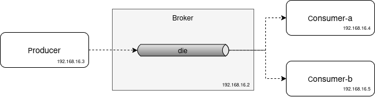
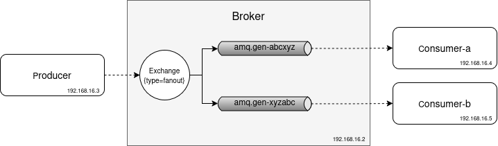
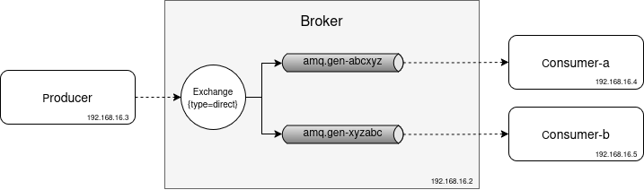
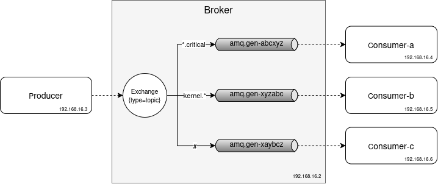
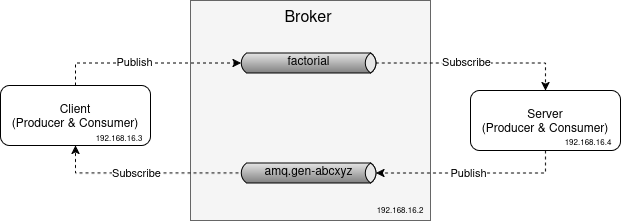

[Table of Contents](../../README.md) | [&larr; WebSocket](../django/docs/WEBSOCKET.md)

## Messaging with RabbitMQ

The following is the supplementary content to the Messaging chapter.
The examples in this chapter show how to work with RabbitMQ.

### Implementation

* [Simple Queue](./1.SimpleQueue/README.md)
* [Work Queue](./2.WorkQueue/README.md)
* [Publish-Subscribe](./3.PubSub/README.md)
* [Routing](./4.Routing/README.md)
* [Topics](./5.Topics/README.md)
* [Request-Response](./6.RequestResponse/README.md)

### Documentation with AsyncAPI

* [Work Queue](./2.WorkQueue/docs/api/v1.0.0/work_queue.yaml)
* [Publish-Subscribe](./3.PubSub/docs/api/v1.0.0/pub_sub.yaml)
* [Routing](./4.Routing/docs/api/v1.0.0/routing.yaml)
* [Topics](./5.Topics/docs/api/v1.0.0/topics.yaml)
* [Request-Response](./6.RequestResponse/docs/api/v1.0.0/rpc.yaml)

### Requirements

* [Docker Engine](https://docs.docker.com/engine/install/) or [Docker Desktop](https://docs.docker.com/desktop/)
* [Docker Compose](https://docs.docker.com/compose/install/)

### Messaging Patterns

This section shows the program flow of common messaging patterns using RabbitMQ.[^1]
The implementation details are described in the book.

#### Work Queue

The diagram below shows the work queue messaging pattern.
The _producer_ (client) sends messages to the _broker_ (server), which stores them in a _die_ queue.
The _consumer-a_ and _consumer-b_ clients consume messages.

<div align="center">
  
</div>

In the demo below, the _producer_ sends six messages.
The _consumer-a_ and _consumer-b_ each receive three messages.
Messages are distributed evenly between the consumers.

```bash
# Setup lab environment
cd src/rabbitmq/2.WorkQueue
docker compose up --detach --wait

# Create a three-pane window using tmux
tmux new-session \; split-window -v \; split-window -h \; select-pane -U \;

# In the bottom left pane run
docker compose exec consumer-a python /usr/src/consumer.py

# In the bottom right pane run
docker compose exec consumer-b python /usr/src/consumer.py

# In the top pane run
for i in {1..6}; do docker compose exec producer python /usr/src/producer.py; done
```

<details>
<summary>Show the above example as an animated GIF</summary>

[](https://youtu.be/bjirkHVoHFA)

</details>

#### Publish-Subscribe

The diagram below shows the publish-subscribe (pub/sub) messaging pattern.
Contrary to the [work queue messaging pattern](#work-queue) where messages are sent directly to the queue, messages in pub/sub are sent by _publisher_ to the _broker_ via an _exchange_, which relays them into _queues_ that are randomly named.
The exchange type is set to be `fanout`, which broadcasts all messages to all queues.
In the pub/sub messaging pattern, every consumer receives all messages.

<div align="center">
  
</div>

In the demo below, the _producer_ sends six messages.
All six messages published by the _producer_ are received by both _consumer-a_ and _consumer-b_.

```bash
# Setup lab environment
cd src/rabbitmq/3.PubSub
docker compose up --detach --wait

# Create a three-pane window using tmux
tmux new-session \; split-window -v \; split-window -h \; select-pane -U \;

# In the bottom left pane run
docker compose exec consumer-a python /usr/src/consumer.py

# In the bottom right pane run
docker compose exec consumer-b python /usr/src/consumer.py

# In the top pane run
for i in {1..6}; do docker compose exec producer python /usr/src/producer.py; done
```

<details>
<summary>Show the above example as an animated GIF</summary>

[](https://youtu.be/kQBNXduP5yc)

</details>

#### Routing

The diagram below shows the routing messaging pattern.
Contrary to the [pub/sub messaging pattern](#publish-subscribe) that uses a `fanout` exchange type, the exchange type in the routing messaging pattern is set to `direct`, which allows messages to be delivered selectively to the queues based on the routing key that describes the message.
The diagram shows three routing keys: `info`, `error`, and `warning`.
All messages with the `info` routing key are sent to the `consumer-a`, and all messages with the `error` and `warning` routing keys are sent to the `consumer-b`.

<div align="center">
  
</div>

In the demo below, the _producer_ sends six messages.
The _consumer-a_ subscribes to the queue that is bound to the `info` routing key, and the _consumer-b_ subscribes to the queue that is bound to the `error` and `warning` routing keys.
The _consumer-a_ receives two messages, and the _consumer-b_ receives four messages.

```bash
# Setup lab environment
cd src/rabbitmq/4.Routing
docker compose up --detach --wait

# Create a three-pane window using tmux
tmux new-session \; split-window -v \; split-window -h \; select-pane -U \;

# In the bottom left pane run
docker compose exec consumer-a python /usr/src/consumer.py info

# In the bottom right pane run
docker compose exec consumer-b python /usr/src/consumer.py error warning

# In the top pane run
for i in {1..6}; do docker compose exec producer python /usr/src/producer.py; done
```

<details>
<summary>Show the above example as an animated GIF</summary>

[](https://youtu.be/292nDKZzR7c)

</details>

#### Topics

The diagram below shows the topic messaging pattern.
As the name suggests, this messaging pattern's exchange type is set to `topic`.
Topic-based message delivery addresses the limitation of message delivery in [routing messaging pattern](#routing), namely, an exchange that uses a routing type set to `direct` doesn't allow routing a message based on multiple criteria.

The routing key is a dot-separated string, and each part of the string can be matched with a wildcard character `*`.
The wildcard matches exactly one word, and the `#` wildcard matches zero or more words.
The diagram shows three routing keys: `*.critical`, `kernel.*`, and `#`.
The _consumer-a_ subscribes to the `*.critical` routing key, which means it receives messages with the routing keys `kernel.critical` and `system.critical`.
The _consumer-b_ subscribes to the `kernel.*` routing key, which means it receives messages with the routing keys `kernel.critical` and `kernel.warning`.
The _consumer-c_ subscribes to the `#` routing key, which means it receives all messages.

<div align="center">
  
</div>

In the demo below, the _producer_ sends six messages.
The _consumer-a_ receives three messages, bound to the `*.critical` routing key.
The _consumer-b_ receives one message, bound to the `kernel.*` routing key.
All six messages are received by the _consumer-c_ and are bound to the `#` routing key.

```bash
# Setup lab environment
cd src/rabbitmq/5.Topics
docker compose up --detach --wait

# Create a four-pane window using tmux
tmux new-session \; split-window -v \; split-window -v \; select-pane -U \; split-window -h \; select-pane -U \;

# In the middle left pane run
docker compose exec consumer-a python /usr/src/consumer.py "*.critical"

# In the middle right pane run
docker compose exec consumer-b python /usr/src/consumer.py "kernel.*"

# In the bottom pane run
docker compose exec consumer-c python /usr/src/consumer.py "#"

# In the top pane run
for i in {1..6}; do docker compose exec producer python /usr/src/producer.py; done
```

<details>
<summary>Show the above example as an animated GIF</summary>

[](https://youtu.be/GbOCglVp8GM)

</details>

#### Request-Response

The diagram below shows the request-response messaging pattern.
The idea behind this pattern is that for every message sent by the _client_ (request) there is a corresponding message (response) sent by the _server_.

The image below shows two applications (clients), one is called _client_ (requestor) and the other _server_ (responder).
Both applications acts as a message publisher and consumer.
The client sends a message along with the correlation id (CID) to the _broker_ service, which stores it in the _factorial_ queue.
The server consumes the message from the factorial queue, processes it, and sends a response back to the _broker_ service, which stores it in the _response_ queue.
The _client_ then consumes the message and check if the CID of the response message matches the CID of the request message.

<div align="center">
  
</div>

The demo below calculates the factorial of a number.
The bottom pane shows the client receiving six messages.
The top pane shows the server sending messages with the factorial calculation results to the client.
Although the client sends the factorial numbers to the server first, the program shows the client at the point of receiving the already calculated factorial.

```bash
# Setup lab environment
cd src/rabbitmq/6.RequestResponse
docker compose up --detach --wait

# Create a two-pane window using tmux
tmux new-session \; split-window -v \; select-pane -U \;

# In the bottom pane run
docker compose exec server python /usr/src/server.py

# In the top pane run
for i in {1..6}; do docker compose exec client python /usr/src/client.py; done
```

<details>
<summary>Show the above example as an animated GIF</summary>

[](https://youtu.be/s0_joSqk11k)

</details>

### Security

This section shows how to use TLS to encrypt communication between RabbitMQ clients and the broker.
Additionally, we describe RabbitMQ's database that stores messages in the filesystem (unencrypted on the disk), and the need for encryption at rest.

#### Messages Encrypted in Transit (AMQPS)

Presented below is the part of the Docker compose file used across all examples.
The `init` service is used as an initialization service (the closest analogy to it would be a [kubernetes init container](https://kubernetes.io/docs/concepts/workloads/pods/init-containers/)), and generates certificates used for TLS.
The `TLS_ENABLE` environment variable set `1` in the `producer` and `consumer` services enables TLS encryption.

```yaml
# src/rabbitmq/2.WorkQueue/compose.yaml

services:
  init:  # <1>
    image: python:3.13-bookworm
    container_name: rabbitmq-init
    entrypoint: ["/bin/sh", "/usr/src/certs.sh"]  # <5>
    working_dir: /usr/src
    volumes: # <2>
      - ./src/scripts/certs.sh:/usr/src/certs.sh
      - certificates:/etc/rabbitmq/ssl:rw

  producer:
    ...
    environment: # <4>
      ...
      - TLS_ENABLE=1
    volumes:  # <2>
      - certificates:/etc/rabbitmq/ssl:ro

  consumer-a:
    ...
    environment: # <4>
      ...
      - TLS_ENABLE=1
    volumes:  # <2>
      - certificates:/etc/rabbitmq/ssl:ro

volumes: # <2>
  certificates: # <3>
    name: rabbitmq-certs
```

1. The purpose of the `init` service is to generate TLS certificates and share them with other services (containers).

2. The `volumes` attribute defines Docker volumes, which are mounted across containers.

3. The certificates _named volume_ persists files independently from the containers' life cycle.
The volume is mounted in all containers as the `/etc/rabbitmq/ssl` directory.
It is used to store and share the TLS certificates: in the `init` container the volume is used to write the generated certificates (`rw` read-write option), and in `producer` and `consumer` containers to read the certificates (`ro` read-only option).

4. The `environment` attribute holds environment variables, including the `TLS_ENABLE` variable, which enables message encryption.

5. The `entrypoint` attribute sets the _src/rabbitmq/2.WorkQueue/src/scripts/certs.sh_ script to be executed on the `init` container startup.
This script generates the TLS certificates.

#### Unencrypted RabbitMQ Storage

RabbitMQ uses [Mnesia](https://www.erlang.org/doc/apps/mnesia/mnesia_overview#the-mnesia-database-management-system), a multi-user distributed database management system (DBMS) to store configuration and states.
However, RabbitMQ doesn't provide built-in support for encrypting data at rest.

Messages in RabbitMQ are held in queues, and queues, as well as exchanges and bindings, are stored in Mnesia.
Mnesia persists data both in memory and on disk.
Storing messages in memory improves performance, whereas storing them on disk as binary files gives persistence and recoverability at the cost of lower performance and security risks if the filesystem is not encrypted.

> [!NOTE]
> There are two ways to store messages on a file system with the Mnesia database.
> The first method is to use the `PERSISTENT_DELIVERY_MODE` option that forces messages to persist on a local filesystem.
> The second method is for transient messages (in-memory messages).
> When the broker accumulates too many transient messages and reaches a particular memory threshold, RabbitMQ will write (dump) these messages to the local filesystem to free up memory.

For encryption at rest, RabbitMQ recommends storing its database on an encrypted file system such as Linux unified key setup (LUKS) for Linux or BitLocker for Windows.
This will ensure that any data written to disk will be automatically encrypted.
If your setup requires storing the Mnesia database in Azure, AWS, GCP, or other cloud providers, use their encryption services.
For example, [Azure Storage](https://learn.microsoft.com/en-us/azure/storage/common/storage-service-encryption) and [Amazon S3 buckets](https://docs.aws.amazon.com/AmazonS3/latest/userguide/bucket-encryption.html) automatically encrypt data when using service-side encryption (SSE).
If you are using a managed RabbitMQ service, then the service provider may take care of encryption at rest, but verify this with the service provider.

The purpose of the following example is to inspect RabbitMQ's Mnesia database and confirm that it stores messages unencrypted.

```bash
# Lab setup <1>
cd src/rabbitmq/2.WorkQueue
docker compose up --detach --wait

# Send a message <2>
docker compose exec producer python /usr/src/producer.py
[x] Sent '{'data': {'message': 'Rolling 3', 'outcome': 3}, 'version': '1.0.0'}'

# Create lab's environment variables <3>
MNESIA_DIR=$(docker compose exec broker \
  rabbitmqctl report | grep mnesia | grep data_dir | tail -n1 | cut -d'"' -f2
)
DB_QS=$(docker compose exec broker bash -c "echo $MNESIA_DIR/msg_stores/vhosts/*/queues/*/0.qs | head -1")

# Inspect binary content <4>
docker compose exec broker xxd $DB_QS
00000000: c000 b830 a9ec 4a39 d786 ffb7 b2fd 9bad  ...0..J9........
00000010: 755f 0000 0000 0000 0000 0000 0044 0000  u_...........D..
00000020: 0109 8368 0477 026d 6377 086d 635f 616d  ...h.w.mcw.mc_am
00000030: 7170 6c68 0677 0763 6f6e 7465 6e74 613c  qplh.w.contenta<
00000040: 7704 6e6f 6e65 6d00 0000 30f0 0010 6170  w.nonem...0...ap
00000050: 706c 6963 6174 696f 6e2f 6a73 6f6e 0575  plication/json.u
00000060: 7466 2d38 0000 0012 0776 6572 7369 6f6e  tf-8.....version
00000070: 5300 0000 0531 2e30 2e30 0277 1972 6162  S....1.0.0.w.rab
00000080: 6269 745f 6672 616d 696e 675f 616d 7170  bit_framing_amqp
00000090: 5f30 5f39 5f31 6c00 0000 016d 0000 0044  _0_9_1l....m...D
000000a0: 7b22 6461 7461 223a 207b 226d 6573 7361  {"data": {"messa
000000b0: 6765 223a 2022 526f 6c6c 696e 6720 3322  ge": "Rolling 3"
000000c0: 2c20 226f 7574 636f 6d65 223a 2033 7d2c  , "outcome": 3},
000000d0: 2022 7665 7273 696f 6e22 3a20 2231 2e30   "version": "1.0
000000e0: 2e30 227d 6a74 0000 0004 7702 6964 6d00  .0"}jt....w.idm.
000000f0: 0000 10b8 30a9 ec4a 39d7 86ff b7b2 fd9b  ....0..J9.......
00000100: ad75 5f77 0178 6d00 0000 0077 0272 6b6c  .u_w.xm....w.rkl
00000110: 0000 0001 6d00 0000 0364 6965 6a77 0372  ....m....diejw.r
00000120: 7473 6e06 00a8 0628 f792 0140 00         tsn....(...@.
```

1. Navigate to the lab's directory, and start containers.

2. Produce one message and send it to the `broker` service.

3. Obtain necessary environment variables.
- `MNESIA_DIR` contains the location of the Mnesia directory.
- `DIR1` and `DIR2` paths are extracted manually by investigating the broker service filesystem at `MNESIA_DIR` dir.
These two IDs will differ for you, and therefore, you'll have to adjust them accordingly.
- `DB_QS` contain a file path to the Mnesia database.

4. Inspect the content of the Mnesia database with the `xxd` program.
It shows the hexadecimal content of the _0.qs_ database, which stores the `die` queue with its messages.
You can see that the produced message is stored in the broker's database as unencrypted binary data.

> [!NOTE]
> The `xxd` (or `hexdump`) program is commonly used for debugging, reverse engineering, and digital forensics to view and examine binary data stored in files, memory dumps, or other forms.
> The program represents every byte as a two-digit hexadecimal number which then can be converted to the ASCII representation of that byte, making it human-readable.

### Documentation

The example below shows how to generate documentation for the work queue example using the [AsyncAPI](https://www.asyncapi.com/) specification.
The AsyncAPI specification is a standard for describing asynchronous APIs, similar to OpenAPI for REST APIs.

```bash
# Enter the exercise directory
cd src/rabbitmq/2.WorkQueue/docs/api/v1.0.0

# Generate HTML documentation
docker run --rm -it --user=root \
       --volume ${PWD}/output:/app/output \
       --volume ${PWD}/work_queue.yaml:/app/asyncapi.yaml \
       asyncapi/cli generate fromTemplate /app/asyncapi.yaml \
       @asyncapi/html-template@3.0.0 \
       --use-new-generator --force-write --output /app/output

# Serve documentation with Nginx
docker run --rm --detach --publish 127.0.0.1:8888:80 \
       --volume ${PWD}/output:/usr/share/nginx/html:ro nginx
```

<details>
<summary>Show the above example as an animated GIF</summary>

[](https://youtu.be/dFdyBJMms-0)

</details>

### Lab Teardown

To clean up the environment, run the following command.
Without cleaning up the environment other labs may experience issues.

```bash
docker compose down --volumes && docker network rm -f rabbitmq
```

[Table of Contents](../../README.md) | [&larr; WebSocket](../django/docs/WEBSOCKET.md)

[^1]: The presented examples are based on the [RabbitMQ documentation](https://www.rabbitmq.com/tutorials).
